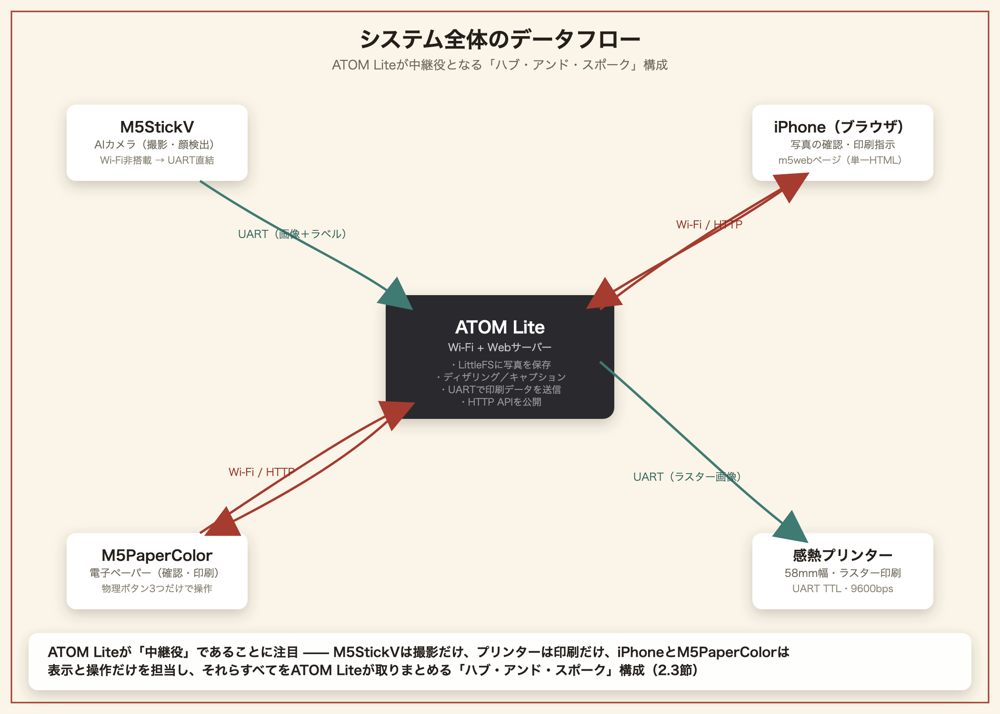
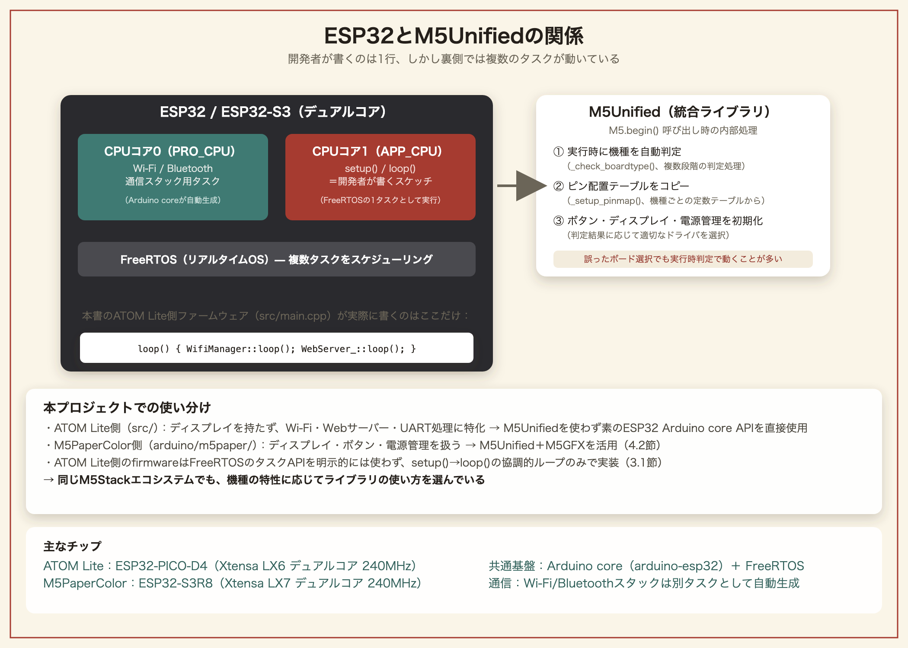
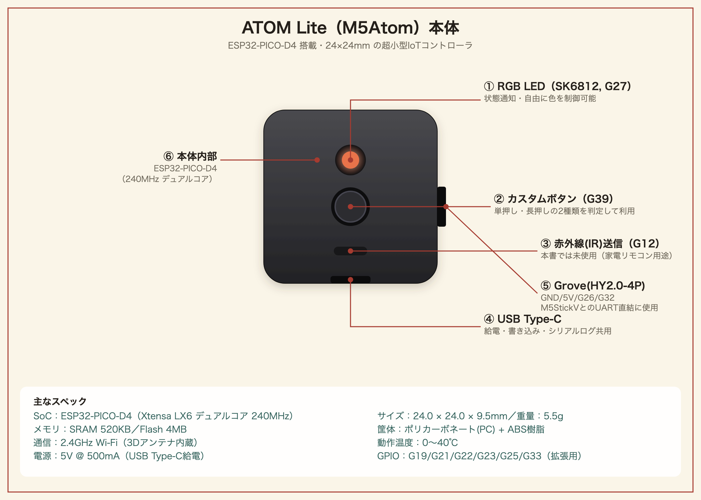
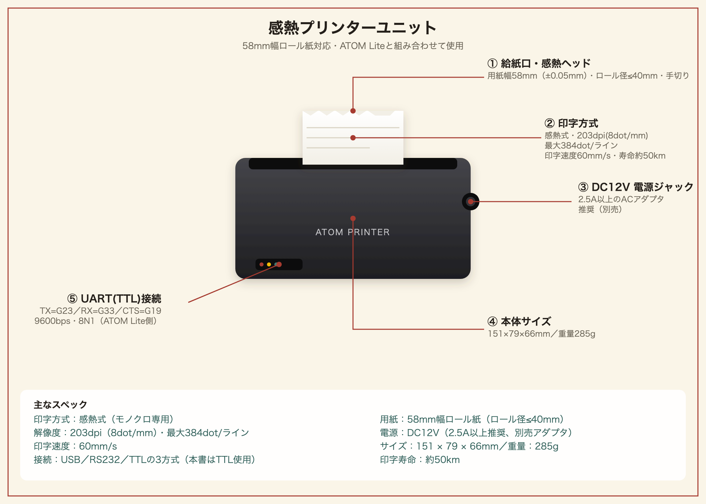
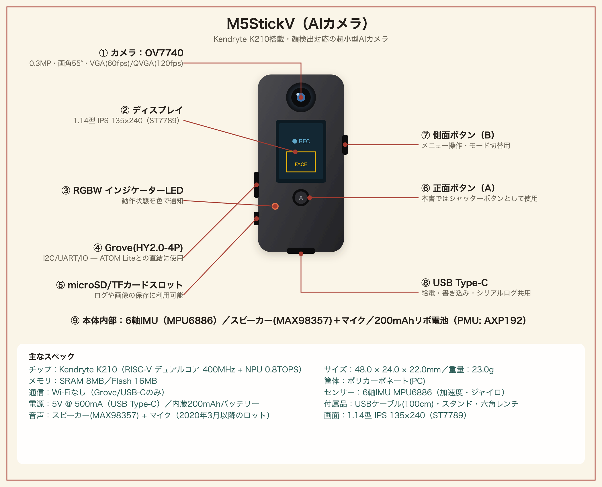
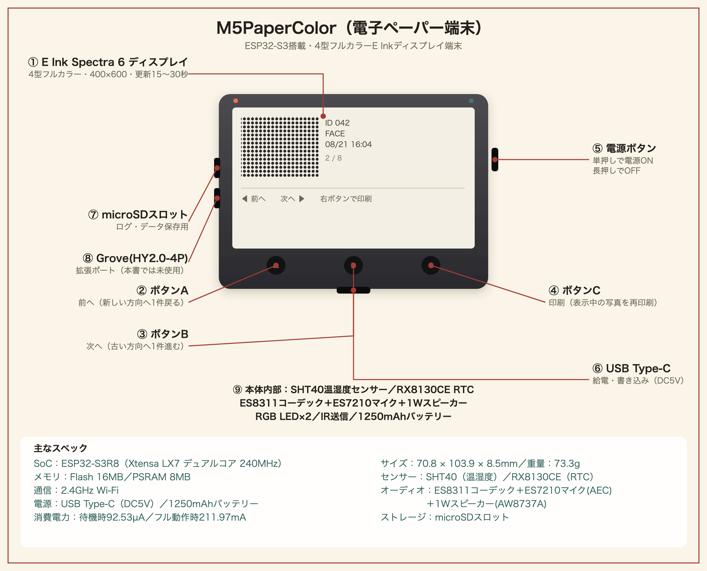
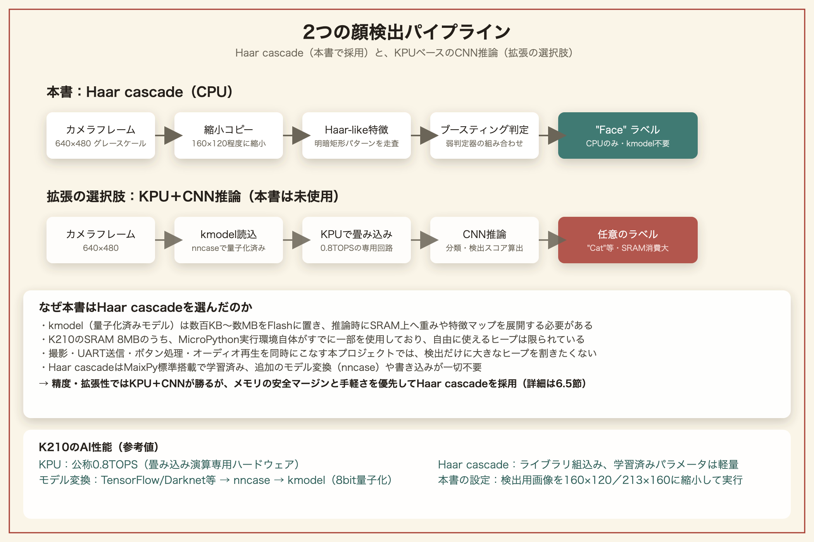
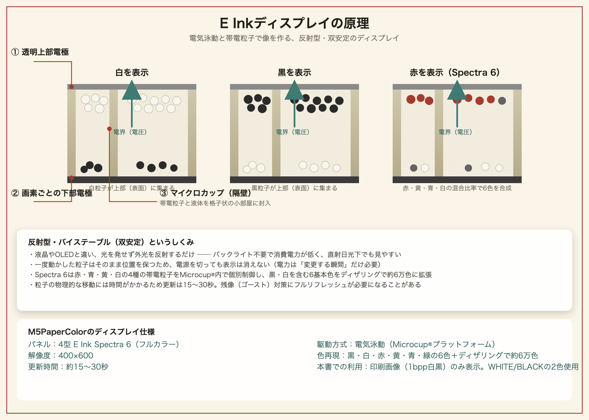
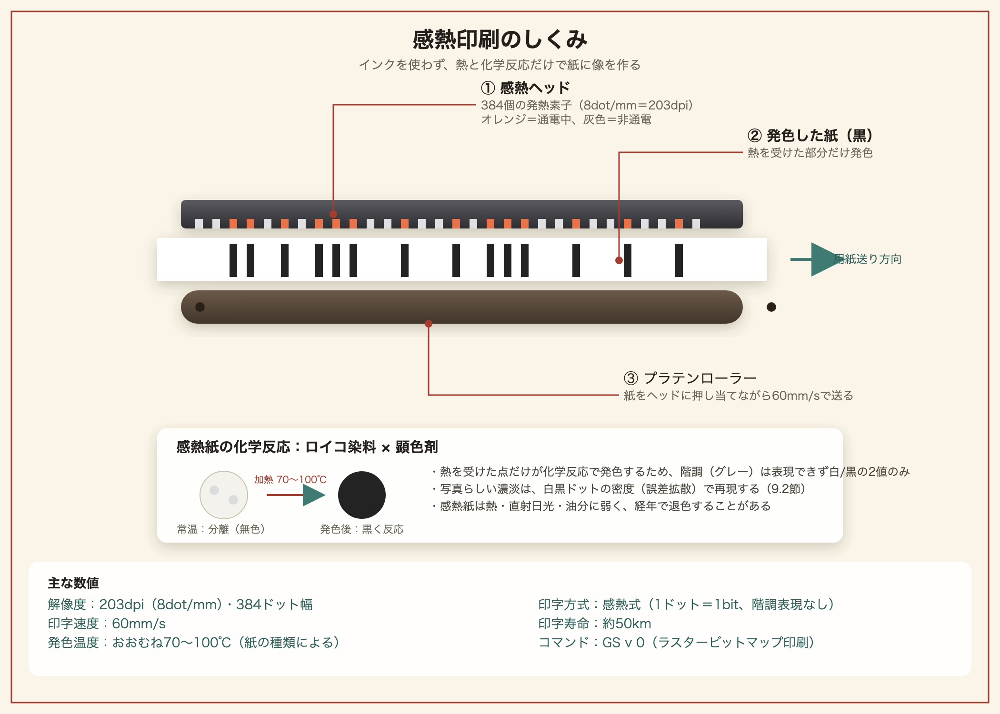

# M5Stackで始める IoTカメラ & プリンター 電子工作超入門
### ATOM Printer × M5StickV × M5Paperで作る、AIカメラと感熱印刷のしくみ

---

## はじめに

スマートフォンで撮った写真は、ほとんどの場合、画面の中だけで完結します。SNSに流れ、クラウドに保存され、そしていつか忘れられる。けれど「シャッターを押した瞬間に、その場でレシートのように紙に印刷される」という体験には、デジタル写真にはない独特の楽しさがあります。

本書では、3台の小さなマイコンボード――**ATOM Printer Kit**（感熱プリンター内蔵）、**M5StickV**（AIカメラ）、**M5Paper**（電子ペーパー端末）――を組み合わせて、次のような一連の体験を作る方法を、ゼロから解説します。

1. M5StickVのボタンを押すと、内蔵カメラで写真を撮る
2. 撮った写真はその場で顔検出にかけられ、「Face」というラベルが付く
3. 写真はケーブル1本でATOM Printer Kitへ送られる
4. iPhoneのブラウザ、またはM5Paperの画面で、送られてきた写真を確認できる
5. 「印刷」を選ぶと、58mm幅の感熱紙に、撮影時刻とラベル付きで写真が印刷される

これは架空の説明ではなく、本書が題材にしている実際のオープンソースプロジェクト「m5web」の仕様に基づいています。ファームウェアのソースコードも、配線も、通信プロトコルも、すべて実在するものです。本書を読み終える頃には、あなたの手元にも同じものが（あるいはあなた自身のアイデアを加えた発展版が）動いているはずです。

### 本書の対象読者

- Arduino・M5Stack系のボードを触ったことがあるが、「複数のデバイスを連携させる」経験はまだない方
- IoT（Internet of Things、モノのインターネット）という言葉は知っているが、実際に手を動かして仕組みを理解したい方
- 電子工作は初めてではないが、Wi-Fi・UART・HTTP APIといった通信の仕組みを整理して学びたい方

電子工作もプログラミングも「はじめて」という方でも読み進められるよう、第1章では前提知識をゼロから説明します。すでに詳しい方は第1章を読み飛ばして第2章から読んでも構いません。

### 本書で扱わないこと

- はんだ付けの基礎（M5Stack系のボードはGroveコネクタでの接続が中心のため、本格的なはんだ付け技術は前提としません）
- C++・Pythonそのものの文法入門（コードは掲載しますが、初歩的な文法解説は最小限にとどめます）

### 完成すると何ができるか

出来上がるシステムは、次の4つのハードウェアで構成されます。

| デバイス | 役割 |
|---|---|
| ATOM Lite + 58mm感熱プリンター（ATOM Printer Kit） | システムの中心。Wi-Fiに接続し、Webサーバーとして動作。写真を白黒ビットマップに変換して印刷する |
| M5StickV（Kendryte K210搭載AIカメラ） | 顔検出付きのカメラ。ボタンを押すと撮影し、有線でATOM Liteに転送する |
| iPhone（またはAndroid、PC） | ブラウザで`m5web`というWebページを開き、写真の確認・印刷・設定変更を行う |
| M5Paper（電子ペーパー） | タッチ操作なしの3つの物理ボタンだけで、iPhoneと同じ確認・印刷操作ができる、もう一つの入り口 |

これらを順番に組み立てながら、それぞれの通信の仕組み（UART、Wi-Fi、HTTP）を理解していきます。

---

## 第1章　IoTの基礎知識

### 1.1　IoTとは何か

IoT（Internet of Things）とは、日本語では「モノのインターネット」と訳されます。従来インターネットに繋がっていなかった「モノ」――家電、センサー、カメラ、プリンターなど――がネットワークに接続され、互いにデータをやり取りする仕組み全体を指します。

本書のプロジェクトを例にすると、次のようなモノがネットワークで（あるいは有線で）繋がっています。

- カメラ（M5StickV）が撮った画像データ
- プリンター（ATOM Printer Kit内蔵）が受け取る印刷データ
- スマートフォン（iPhone）が表示・操作するWebページ
- 電子ペーパー（M5Paper）が表示する状態

これらが単体で動いているだけなら、ただの電子工作です。IoTと呼べるのは、これらが**ネットワークやケーブルを介して連携し、一つの体験を作り出している**からです。

### 1.2　マイコンとコンピューターの違い

本書で使う3台のボード（ATOM Lite、M5StickV、M5Paper）は、すべて「マイコン」と呼ばれる小型のコンピューターです。パソコンやスマートフォンと同じく「コンピューター」の仲間ですが、次のような違いがあります。

| | パソコン・スマホ | マイコン（本書のボード） |
|---|---|---|
| OS | Windows / macOS / iOSなど汎用OS | OSが無いか、非常に軽量（RTOSなど） |
| 用途 | 汎用（何でもできる） | 特定の用途に特化（今回はカメラ・印刷・表示） |
| 起動 | 数十秒 | 一瞬（電源を入れて即座にプログラムが走る） |
| 価格 | 数万円〜 | 数千円程度 |
| プログラムの入れ替え | アプリのインストール | 「書き込み（フラッシュ）」と呼ばれる作業で、動作するプログラムそのものを丸ごと入れ替える |

マイコンには基本的に1つのプログラムしか書き込まれておらず、電源を入れるとそのプログラムが延々とループし続けます。本書で扱う`m5web`ファームウェアも、`setup()`という初期化処理を1回だけ実行したあと、`loop()`という関数を電源が切れるまでずっと繰り返します。これは後の章で実際のコードを見ながら確認します。

### 1.3　通信方式のミニ辞典

本プロジェクトでは、性質の異なる3種類の通信が登場します。混同しやすいので、ここで整理しておきます。

**UART（シリアル通信）**

もっとも原始的な通信方式で、送信線（TX）と受信線（RX）、そしてグラウンド（GND）の最小3本の線があれば、2つのマイコンの間でデータをやり取りできます。Wi-Fiのような複雑な設定は不要な代わりに、通信速度（ボーレート）を両側で正確に一致させる必要があります。本書では、M5StickVからATOM Liteへ写真データを送るのにUARTを使います。プリンター内蔵の印字ヘッドへの命令送信にもUARTが使われています。

**Wi-Fi**

家庭やオフィスにある無線LANのことです。ATOM LiteとM5Paperは、それぞれ自力でWi-Fiに接続できるチップを内蔵しています（M5StickVにはWi-Fi機能がないため、UARTで直結する設計になっています）。Wi-Fiに繋がった機器同士は、IPアドレスを使って自由に通信できます。

**HTTP（Webの通信規約）**

ブラウザが日常的にWebサイトを見るときに使っている通信規約です。ATOM Liteは、内部にごく小さなWebサーバーを持っており、iPhoneのブラウザやM5Paperからの「この写真をちょうだい（GETリクエスト）」「これを印刷して（POSTリクエスト）」といった要求に応答します。この「Webサーバーとしてのマイコン」という考え方が、本書のキモになる部分です。

### 1.4　なぜこの3台なのか

IoTデバイスを作るとき、「1台に全部の機能を詰め込む」のではなく、「役割ごとに小さなデバイスへ分割し、通信で繋ぐ」という設計が一般的です。理由は次の通りです。

1. **それぞれの得意分野を活かせる**：M5StickVはAIカメラに特化した小型・省電力設計、ATOM Printer Kitは印刷という重い処理（プリンターへの給電・制御）に専念、M5Paperは省電力な電子ペーパー表示に専念、という役割分担ができます。
2. **一方が壊れても被害が限定される**：カメラだけ壊れても、印刷機能自体は生きています。
3. **拡張しやすい**：将来、别のセンサーや別の表示端末を足したくなったとき、UARTやHTTP APIという「共通の窓口」さえ守れば、既存の仕組みを壊さずに追加できます。

本書のシステムでも、この考え方に沿って設計されています。ATOM Liteが中心（ハブ）となり、M5StickVからはUARTで、iPhoneやM5PaperからはWi-Fi経由のHTTPで、それぞれ接続する構成になっています。

### 1.5　本書のシステム全体を図で理解する

文章だけでは掴みにくいので、データの流れを図式化します。

```
┌─────────────┐   UART (有線・115200bps)   ┌───────────────────────┐
│  M5StickV   │ ─────────────────────────▶ │       ATOM Lite        │
│ (AIカメラ)   │   画像データ + 顔検出ラベル  │  (Wi-Fi + Webサーバー)  │
└─────────────┘                            │                        │
                                            │  ・写真をLittleFSに保存 │
┌─────────────┐   Wi-Fi / HTTP             │  ・明るさ/コントラスト  │
│   iPhone    │ ◀─────────────────────────▶│    調整・ディザリング  │
│ (ブラウザ)   │   写真の確認・印刷指示       │  ・キャプション焼き込み │
└─────────────┘                            │  ・UARTでプリンターへ   │
                                            │    印刷データを送信     │
┌─────────────┐   Wi-Fi / HTTP             │                        │
│   M5Paper   │ ◀─────────────────────────▶│                        │
│ (電子ペーパー)│  物理ボタンで同じ操作       └───────────┬───────────┘
└─────────────┘                                         │ UART (9600bps)
                                                          ▼
                                                ┌───────────────────┐
                                                │ 58mm感熱プリンター  │
                                                └───────────────────┘
```

{width=6.7in}

ATOM Liteが「中継役」であることに注目してください。M5StickVは撮影だけ、プリンターは印刷だけ、iPhoneとM5Paperは表示と操作だけを担当し、それらすべてをATOM Liteが取りまとめています。次章からは、この4つのパーツをひとつずつ詳しく見ていきます。

---

## 第2章　プロジェクトの全体像

### 2.1　完成品のユーザー体験を先に確認する

コードや配線の話に入る前に、実際に完成したときの「使い心地」を確認しておきましょう。ゴールが分かっていると、途中の作業の意味が理解しやすくなります。

**シナリオA：M5StickVで撮ってその場で印刷する**

1. M5StickVを手に取り、画面に写したいものを映す（画面には顔検出の白い枠がリアルタイムで表示される）
2. ボタンAを押す。画面が白く光り、内蔵LEDが白く点灯し、シャッター音が鳴る（＝処理中の合図）
3. 撮影が完了すると、LEDが緑色に一瞬点灯する（＝ATOM Lite側への送信完了の合図）
4. ATOM Lite側では、届いた写真をディザリング処理し、設定次第でそのまま印刷するか、確認待ちの状態にする
5. iPhoneで`http://m5web.local`を開くと、「M5StickVカメラ」カードに撮った写真のプレビューが表示されている
6. 「印刷」ボタンを押すと、日付・時刻とラベル（例：`FACE 08/21 14:32`）付きで感熱紙に印刷される

**シナリオB：iPhone内の写真をアップロードして印刷する**

1. `http://m5web.local`を開き、「画像を印刷」カードで好きな写真を選ぶ
2. ブラウザ内で自動的に384ドット幅にリサイズされ、白黒のプレビューが表示される
3. 明るさ・コントラスト・変換方式（誤差拡散／網掛け／単純2値化）を必要に応じて微調整する
4. 「この画像を印刷」を押すと、印刷される

**シナリオC：M5Paperだけで完結させる**

1. M5Paperの画面に、ATOM Lite側に保存されているギャラリー（M5StickVカメラ撮影・アップロード両方の保存履歴）が新しい順に大きく表示される。ボタンを押すたびに短いビープ音で反応を教えてくれる
2. 左ボタンで前へ、中央ボタンで次へ（既定の「自動更新無し」ではこの操作のたびにATOM Lite側と同期し直す）、右ボタンで印刷。印刷が成功すると画面に「Printed」と表示され、大きめの二重ビープが鳴る
3. iPhoneを一切使わずに、カメラで撮った写真・アップロードした写真の両方を確認・再印刷できる

この3つのシナリオが、それぞれ独立した「入り口」でありながら、裏側では同じATOM Liteの仕組みを共有しているという点が、このプロジェクトの設計の面白さです。

### 2.2　プロジェクトを構成するソフトウェアの全体地図

本プロジェクトは、次の4つの独立したプログラム（ファームウェア／スクリプト）で構成されています。

| # | 対象デバイス | 開発言語・環境 | 役割 |
|---|---|---|---|
| ① | ATOM Lite | C++（PlatformIO / Arduino IDE） | システムの中枢。Wi-Fi、Webサーバー、印刷処理、写真の保存 |
| ② | M5StickV | Python（MaixPy、K210専用の組み込みPython） | カメラ撮影、顔検出、UART送信 |
| ③ | M5PaperColor | C++（Arduino IDE、M5Unified／M5GFXライブラリ） | ATOM LiteのHTTP APIを叩いて写真確認・印刷操作を行うクライアント |
| ④ | ブラウザ側Web UI | HTML/CSS/JavaScript（単一ファイル、外部ライブラリなし） | iPhoneなどのブラウザで動く操作画面。画像の白黒変換もブラウザ内で完結する |

④が「外部ライブラリなし」という点は特筆に値します。一般的なWeb開発ではnpmやCDN経由で様々なライブラリを読み込みますが、本プロジェクトのWeb UIは、たった1つのHTMLファイルの中にCSSとJavaScriptがすべて収められています。これは、ATOM Lite内蔵のフラッシュメモリ（LittleFS）が非力なため、依存ライブラリを増やしたくないという設計判断です。

### 2.3　「ATOM Lite中心」というアーキテクチャの利点

システム全体を見て気づくのは、**M5StickVもM5Paperも、お互いの存在を知らない**という点です。M5StickVは「ATOM LiteにUARTで画像を送る」ことしか知らず、M5Paperは「ATOM LiteのHTTP APIを叩いてギャラリーを取得・同期する」ことしか知りません。両者が直接会話することは一切なく、すべての情報はATOM Liteを経由します。

このような設計を「ハブ・アンド・スポーク型」と呼ぶことがあります。利点は次の通りです。

- M5Paperを増設したければ、ATOM Lite側は何も変更せず、M5Paper側だけ用意すればよい（実際、本プロジェクトでも「ATOM Lite側の追加設定・改造は不要」と明記されています）
- 逆に、M5StickVの代わりに別のカメラモジュールを使いたくなっても、UART経由で同じ通信プロトコルを話せば、ATOM Lite側のコードは変更不要
- 状態（今どの写真が確認待ちか、印刷モードは自動かプレビューか）を、ATOM Lite一箇所だけが管理するため、複数の入り口（iPhone・M5Paper）から操作しても状態がズレない

次章では、この3台のハードウェアそれぞれについて、購入時に知っておくべき仕様と特徴を詳しく解説します。

---

## 第3章　使用デバイスの解説

### 3.1　M5Stackとは（製品ラインナップ）

本書に入る前に、まず「M5Stack」というブランドそのものについて整理しておきます。ATOM Lite・M5StickV・M5Paperは、いずれもこのM5Stackという中国・深セン発のメーカーが展開する製品ラインの一部です。ラインナップ全体を知っておくと、本書で扱わない他の機種に触れるときや、将来システムを拡張するときの見通しが立てやすくなります。

**M5Stackというメーカーの立ち位置**

M5Stackは、Espressif社のESP32系チップ（および一部の機種ではAI向けの別系統チップ）を土台に、ディスプレイ・バッテリー・センサーなどをコンパクトな筐体にまとめた「モジュール式マイコンボード」を数多く展開しているメーカーです。2016年前後に深センで創業し、「本体（Core）に機能拡張ボードを積み重ねる（スタックする）」という発想を製品名の由来としています。個々の基板を自分ではんだ付けしなくても、Groveコネクタ（4ピンの規格化されたコネクタ）でセンサーやアクチュエータを次々とつなげられる点が最大の特徴で、電子工作の試作スピードを大きく引き上げてくれます。

**製品ラインナップの分類**

M5Stackの製品は非常に種類が多いですが、大きく次のように分類すると全体像をつかみやすくなります。

| 系統 | 代表機種 | 特徴 |
|---|---|---|
| Core系 | M5Stack Basic／Gray／Fire、Core2、CoreS3 | ディスプレイ・バッテリー・スピーカーを一体化した主力ライン。本体単独でアプリが完結する、もっとも「M5Stackらしい」見た目の機種群 |
| ATOM系 | ATOM Lite、ATOM Matrix、ATOM Echo、ATOMS3 | 一辺24mm角程度の超小型キューブ型。最小構成でセンサー・アクチュエータのハブとして使うことが多い。**本書のATOM Printer Kitはこの系統** |
| Stick系 | M5StickC、M5StickC Plus／Plus2、M5StickV | ペン型の縦長ボディ。M5StickVはAIカメラに特化した特殊機種で、他のStick系とは異なりESP32ではなくKendryte K210チップを搭載する。**本書のAIカメラはこの系統** |
| Paper系 | M5Paper、M5PaperS3 | 電子ペーパー（E-Ink）ディスプレイを搭載。低消費電力・屋外での視認性の高さが特徴。**本書の確認用端末はこの系統** |
| Cardputer系 | M5Cardputer | 小型QWERTYキーボードを一体化した携帯端末型 |
| Dial系 | M5Dial | 円形ディスプレイとロータリーエンコーダーを備えた、腕時計やダイヤル操作機器向けの機種 |
| Unitシリーズ | 温湿度センサー、距離センサー、モータードライバなど多数 | Core系・ATOM系などの本体にGroveケーブルで追加する拡張パーツ群。単体では動作せず、必ず本体と組み合わせて使う |
| Moduleシリーズ | LTE通信、GPS、LoRaなど | Core系本体の底面に積み重ねて機能拡張する基板群（「スタック」の名の由来そのもの） |
| Baseシリーズ | バッテリー拡張、プロトタイピング用基板など | Core系本体の底面に積み重ねる、主に電源・拡張用の基板群 |

Unit／Module／Baseシリーズは、それ単体では「マイコン」として動作しない拡張パーツである点が、Core系・ATOM系・Stick系・Paper系・Cardputer系・Dial系（＝それ自体にマイコンチップを搭載し、単体でプログラムを書き込める「本体」）と根本的に異なります。本書のATOM Lite・M5StickV・M5Paperは、いずれも単体で書き込み・動作が完結する「本体」側の機種です。

**共通のソフトウェア資産という考え方**

これだけ機種が多いと、機種ごとにまったく別のコードを書かなければならないように思えるかもしれません。実際、古くからあるライブラリ（`M5Stack`、`M5StickC`、`M5Core2`など）は機種別に分かれていましたが、近年のM5Stack公式は**M5Unified**という、複数機種を横断的にサポートする統合ライブラリの利用を推奨しています。これを使うと、`M5.begin()`のような共通のAPI呼び出しだけで、実行時にどの機種に書き込まれたかを自動判定し、ボタン・ディスプレイ・電源管理などを適切に初期化してくれます。次節以降で扱うArduino IDEの開発環境構築でも、この点に改めて触れます。

**M5Unifiedはどうやって機種を見分けているのか**

{width=6.7in}

`M5.begin()`を呼ぶと、ライブラリ内部では複数段階の判定処理（`_check_boardtype()`）が実行時に走り、今どの機種の上で動いているかを自動的に特定します。これはコンパイル時にArduino IDEで選んだボード設定とは独立した処理で、そのため**「ボード選択を間違えても、実行時の自動判定のおかげで多くの場合そのまま正常に動く」**という、他の組み込み開発ではあまり見られない柔軟性を持っています。判定結果に応じて、機種ごとにコンパイル時定数として用意されているピン配置テーブルが実行時のルックアップテーブルへコピーされ（`_setup_pinmap()`）、以降のボタン・ディスプレイ・電源管理などのAPI呼び出しがすべて正しいピンを参照するようになります。

ただし本書のATOM Lite側ファームウェア（`src/`）は、この節で説明したM5Unifiedを**あえて使っていません**。理由は4.2節でも触れますが、ATOM Liteはディスプレイを持たず、Wi-Fi・Webサーバー・UART通信という処理に特化しているため、M5Unifiedの機種自動判定やディスプレイ抽象化の恩恵がほとんど無く、素のESP32 Arduino core APIを直接使うほうがシンプルだからです。一方、第7章で扱うM5PaperColor側のスケッチ（`arduino/m5paper/m5paper.ino`）はディスプレイ・ボタン・電源管理を扱うため、M5Unifiedとその描画ライブラリM5GFXを活用しています。**同じプロジェクトの中でも、機種の特性に応じてライブラリの使い方を使い分けている**という点は、実践的なM5Stack開発の一例として覚えておくと良いでしょう。

**ESP32というチップそのものについて**

ATOM Lite・M5PaperColorが搭載するESP32系チップは、いずれも**Xtensa系のデュアルコアプロセッサ**（ATOM LiteはESP32-PICO-D4のLX6コア、M5PaperColorはESP32-S3のLX7コア）を採用しています。Espressif社が提供するArduino core（`arduino-esp32`）は、内部的にFreeRTOSというリアルタイムOS上に構築されており、開発者が書く`setup()`／`loop()`自体も、実はFreeRTOSが管理する1つの「タスク」として動いています。Wi-FiやBluetoothの通信スタックは、それとは別の専用タスクとして裏側で自動的に生成され、多くの場合もう一方のCPUコアで動作します。つまり、開発者が特に意識しなくても、**マイコン内部ではすでに簡易的なマルチタスクOSが動いている**ということです。

本書のATOM Lite側ファームウェア（`src/main.cpp`）は、このマルチタスク機能を明示的には使っておらず、`loop()`の中で`WifiManager::loop()`・`WebServer_::loop()`を毎回順番に呼び出すだけの、素朴な「協調的ループ」方式で書かれています。複数の処理を同時に進めているように見えるのは、各`loop()`関数が短時間で処理を終えてすぐ制御を返す（＝ブロッキングしない）ように設計されているためで、本格的なマルチスレッドプログラミングをしているわけではありません。小規模な組み込みプロジェクトでは、このくらいシンプルな設計のほうが、デッドロックや競合状態といったマルチタスク特有のバグを避けられて安全という判断です。

### 3.2　ATOM Printer Kit（ATOM Lite + 58mm感熱プリンター）

**ATOM Lite**は、M5Stack社が販売する超小型のマイコンボードです。一辺24mm角というサイコロのようなサイズながら、次のスペックを持ちます。

- チップ：ESP32-PICO-D4（Wi-Fi・Bluetooth内蔵）
- 内蔵ボタン、RGB LED（SK6812、G27ピン）
- USB Type-Cで給電・プログラム書き込み
- Groveコネクタで外部機器と簡単に接続可能

#### ATOM Liteの詳細ハードウェア仕様

{width=6.7in}

| 項目 | 内容 |
|---|---|
| SoC | ESP32-PICO-D4（Xtensa® LX6 デュアルコア、最大240MHz） |
| メモリ | SRAM 520KB／Flash 4MB（SPI） |
| 通信 | 2.4GHz Wi-Fi（3Dアンテナ内蔵）・Bluetooth |
| ボタン | カスタムボタン×1（G39） |
| LED | RGB LED（SK6812 3535、G27） |
| 赤外線 | IR送信×1（G12、本書では未使用） |
| ポート | USB Type-C×1、Grove(HY2.0-4P)×1（GND/5V/G26/G32） |
| 拡張GPIO | G19／G21(I2C SCL)／G22／G23／G25(I2C SDA)／G33 |
| 電源 | 入力5V @ 500mA（USB Type-C給電） |
| サイズ・重量 | 24.0 × 24.0 × 9.5mm／5.5g |
| 筐体 | ポリカーボネート(PC) + ABS樹脂 |
| 動作温度 | 0〜40℃ |

**本書での使い方との対応**：カスタムボタン（G39）は単押し・ダブルクリック・5秒以上の長押しの3種類を判定しており、単押しは直近フレームの再印刷（6.7節）、ダブルクリック（2回目の単押しが400ms以内）は俳句／ポエムの生成モード切り替え（8.4節）、長押しはWi-Fi設定のリセット（5.3節）に割り当てています。単押しは、2回目の押下が400ms以内に来なかった場合にのみ確定するため、反応が最大400ms遅れます。RGB LED（G27）は`src/led.*`が状態表示に使い、ギャラリー保存時の点滅・印刷可能状態の点灯などを制御しますが、その点灯色そのものが俳句／ポエムのどちらのモードかを表します（緑＝俳句、青＝ポエム、6.8節）。Grove端子のG26/G32は、M5StickVとのUART直結という本書の核となる配線にそのまま使われています（6.1節）。IR送信（G12）は本プロジェクトでは配線・コードともに未使用です。

**ATOM Printer Kit**は、このATOM Liteと58mm幅の感熱プリンターユニットをセットにした製品です。感熱プリンターとは、レシートなどでおなじみの、専用の感熱紙に熱を加えることでインクなしに印字する方式のプリンターです。インクリボンやトナーが不要な代わりに、専用紙（感熱紙）が必要になります。

配線は非常にシンプルで、ATOM LiteのUARTピン（TX/RX）とプリンター側を接続するだけです。

| ATOM Lite | プリンター |
|---|---|
| G23（TX） | RX |
| G33（RX） | TX |
| 5V / GND | 電源 |

ここで初心者がつまずきやすいのが、**電源系統が2つに分かれている**という点です。ATOM Lite自体はUSBから給電できますが、プリンターの印字ヘッドは大きな電流を必要とするため、別途**DC12V・2.5A以上のACアダプタ**が必要です。USBだけ繋いでプリンターが動かない場合は、まずこのACアダプタの接続を疑ってください。

UART通信の速度（ボーレート）は9600bpsに固定されています。これは決して高速ではなく、本書の制限事項の章で触れるように、大きな画像を印刷する際は転送に数十秒かかることがあります。

#### 感熱プリンターユニットの詳細ハードウェア仕様

{width=6.7in}

| 項目 | 内容 |
|---|---|
| 印字方式 | 感熱式（モノクロ専用、インクリボン不要） |
| 解像度 | 203dpi（8dot/mm）・最大384dot/ライン |
| 印字速度 | 60mm/s |
| 印字寿命 | 約50km（累計印字距離の目安） |
| 用紙 | 58mm幅（±0.05mm）ロール紙、厚さ0.05〜0.1mm、ロール径≤40mm、手切りカット |
| 接続方式 | USB／RS232／TTLの3方式に対応（本書はTTL・UART 9600bps 8N1のみ使用） |
| TTL配線 | TX=G23、RX=G33、CTS=G19（コネクタ上にCTSも存在するが、本書のファームウェアはTX/RXの2線のみ配線・使用） |
| 電源 | DC12V（2.5A以上のACアダプタ推奨、別売） |
| サイズ・重量 | 151 × 79 × 66mm／285g |

**本書での使い方との対応**：`src/printer.cpp`はESP32の`HardwareSerial`（Serial2）をTX(G23)・RX(G33)の2線のみで`begin(9600, SERIAL_8N1, kRxPin, kTxPin)`初期化しており、CTSによるハードウェアフロー制御は行っていません。印字速度60mm/sという制約が、本書の制限事項の章で触れる「大きな画像ほど転送・印字に時間がかかる」という体験に直結しています。

> **コラム：ATOMSシリーズとの違い**
> M5Stack社にはATOM Lite以外にも、タッチ操作が可能な「ATOMS3」など類似シリーズがあります。ピン配置が異なるため、そうした別機種を使う場合は、ファームウェア内の`kRxPin`/`kTxPin`定義と、ビルド設定ファイル（`platformio.ini`）内のボード指定を書き換える必要があります。本書ではATOM Lite（`m5stack-atom`）を前提に解説します。

### 3.3　M5StickV（Kendryte K210搭載AIカメラ）

**M5StickV**は、AI推論用のチップ「Kendryte K210」を搭載した、片手に収まるサイズのカメラ付きマイコンです。特徴は以下の通りです。

- KPU（K210 Processing Unit）と呼ばれる専用回路により、消費電力を抑えつつ画像認識（物体検出・分類など）を実行できる
- カラーカメラ、小型ディスプレイ、内蔵スピーカー、RGB LED、物理ボタンを搭載
- Wi-Fi非搭載（本書のプロジェクトではこれが理由で、Wi-FiではなくUART直結という設計を選んでいる）
- プログラミング言語は**MaixPy**というMicroPythonの派生環境を使用（IDEも専用の「MaixPy IDE」を使う）

#### M5StickVの詳細ハードウェア仕様

{width=6.7in}

| 項目 | 内容 |
|---|---|
| チップ | Kendryte K210（RISC-V 64bit デュアルコア 400MHz＋NPU 0.8TOPS） |
| メモリ | SRAM 8MB／Flash 16MB |
| カメラ | OV7740（0.3MP、画角55°、VGA 60fps／QVGA 120fps） |
| ディスプレイ | 1.14型 IPS 135×240（ST7789） |
| ボタン | 正面ボタン(A)・側面ボタン(B)の2つ |
| LED | RGBWインジケーターLED×1 |
| センサー | 6軸IMU MPU6886（加速度・ジャイロ） |
| オーディオ | スピーカー(MAX98357)＋マイク（2020年3月以降のロットで搭載） |
| バッテリー | 200mAhリポ電池（PMU: AXP192） |
| ストレージ | microSD/TFカードスロット |
| ポート | USB Type-C×1、Grove(HY2.0-4P)×1（I2C/UART/IO） |
| サイズ・重量 | 48.0 × 24.0 × 22.0mm／23.0g |
| 付属品 | USBケーブル(100cm)・スタンド・六角レンチ |

**本書での使い方との対応**：正面ボタン(A)は`m5web_capture.py`でシャッターボタンとして使い、押すと撮影→顔検出→ATOM Liteへの送信という一連の処理が始まります（6.3節）。RGBWインジケーターLEDは処理中に白、送信完了時に緑へ切り替わる合図として使われます（同節）。側面ボタン(B)・6軸IMU・スピーカー/マイク・microSDスロットは、本書のファームウェアでは未使用です（K210のKPUを使った物体分類への拡張案は11.1節で触れます）。Grove端子はATOM LiteとのUART直結（G34→G32、G35←G26）にそのまま使われています（6.1節）。Wi-Fiが無いこの構成上の制約が、本書がM5StickVだけ直結UARTという別経路を選んだ理由です。

M5StickVはWi-Fiを持たないため、単体ではインターネットにもATOM Liteにも接続できません。そこで本プロジェクトでは、**Grove端子を使ったUART直結**という手段で、両者を配線1本（正確にはGND含め2〜3本）で繋いでいます。

| M5StickV | ATOM Lite | 備考 |
|---|---|---|
| G34（UART1 TX） | G32（RX） | 画像データを送る一方向のみ実際に使用 |
| G35（UART1 RX） | G26（TX） | 現状未使用（将来の応答用に配線だけ用意） |
| GND | GND | |

ここでも注意点があります。**VCC（電源）ピン同士は接続しません**。M5StickVとATOM Liteはそれぞれ別々に電源供給される設計なので、電源線まで繋いでしまうと電位差によるトラブルの原因になります。

> **コラム：K210のメモリはとても小さい**
> M5StickVに搭載されているKendryte K210は高性能なAIチップですが、MicroPythonが自由に使えるヒープメモリ（プログラムが動的に確保できる作業用メモリ）は非常に限られています。本書の第6章で詳しく扱いますが、「384×512ピクセル程度の画像バッファを1つ作っただけでメモリ不足になる」という制約が、実際のプログラム設計に大きな影響を与えています。小型AIカメラを使いこなす上で、こうしたメモリ制約への対処は避けて通れないテーマです。

### 3.4　M5PaperColor（電子ペーパー端末）

**M5PaperColor**は、約4インチのE Ink Spectra 6カラー電子ペーパーディスプレイを搭載したM5Stack社の製品です（ESP32-S3ベース）。電子ペーパーは、電源を切っても表示内容が消えない・直射日光下でも見やすい・消費電力が非常に低いという特徴を持ちます。従来のモノクロ「M5Paper」（M5EPDライブラリを使用）とは別機種・別ライブラリ構成なので、購入・書き込みの際は取り違えないよう注意してください。

#### M5PaperColorの詳細ハードウェア仕様

{width=6.7in}

| 項目 | 内容 |
|---|---|
| SoC | ESP32-S3R8（Xtensa® LX7 デュアルコア、最大240MHz） |
| メモリ | Flash 16MB／PSRAM 8MB（Octal） |
| 通信 | 2.4GHz Wi-Fi |
| ディスプレイ | 4型 E Ink Spectra 6 フルカラー、400×600、更新約15〜30秒 |
| ボタン | ユーザーボタンA/B/Cの3つ＋電源ボタン1つ |
| センサー | SHT40（温湿度）、RX8130CE（RTC） |
| オーディオ | ES8311コーデック＋ES7210マイク(AEC)＋1Wスピーカー(AW8737A) |
| LED・赤外線 | RGB LED×2、IR送信×1 |
| バッテリー | 1250mAh（待機時92.53µA／フル動作時211.97mA） |
| ストレージ | microSDスロット |
| ポート | USB Type-C×1（DC5V）、Grove(HY2.0-4P)拡張ポート×1 |
| サイズ・重量 | 70.8 × 103.9 × 8.5mm／73.3g |

**本書での使い方との対応**：`m5paper.ino`はボタンA/Bをギャラリーの前へ/次への送りに、ボタンCを「表示中の写真を再印刷」に割り当てています（7.3節）。電源ボタンは単押しで電源ON、長押しでOFFという機器本来の挙動のままです。SHT40・RX8130CE・オーディオコーデック・RGB LED・IR送信・microSDスロットは、いずれも本書のスケッチでは未使用です（ビープ音の再生にはES8311コーデック経由のスピーカーを使っています）。E Ink Spectra 6ディスプレイは6色対応ですが、印刷画像自体がすでに1bpp白黒ビットマップのため、本書ではWHITE/BLACKの2色しか使っていません（7.4節）。

工場出荷時のM5PaperColorには、標準ファームウェア（Wi-Fi接続や画像アップロード機能を備えたデモアプリ）があらかじめ書き込まれています。本プロジェクトでは、このM5PaperColorに**専用のスケッチ（`m5paper.ino`）を書き込んで**、ATOM LiteのHTTP APIを叩くだけの軽量なクライアント端末として使います。

重要な注意点として、**この書き込みによって工場出荷時の標準ファームウェアは上書きされます**。1台のM5PaperColorに同時に2つのファームウェアを共存させることはできないため、標準機能に戻したい場合は標準ファームウェアを再度書き込むか、本プロジェクト専用にもう1台用意する必要があります。

M5PaperColorにはタッチパネルが無く、**画面下部の3つの物理ボタン（BtnA・BtnB・BtnC）だけで操作する**設計になっています。

| ボタン | 機能 |
|---|---|
| BtnA（左） | 前へ（ギャラリーを新しい方向へ1件戻る） |
| BtnB（中央） | 次へ（ギャラリーを古い方向へ1件進む） |
| BtnC（右） | 印刷（表示中の写真を再印刷） |

どのボタンを押しても短いビープ音で反応を確認でき、BtnA/BtnBを素早く2回押すと区別できる二重ビープが鳴る（詳細は第7章）。M5PaperColorはES8311コーデック＋1Wスピーカーを内蔵しているため、この音声フィードバックには追加の部品は不要です。

ライブラリは**M5Unified**・**M5GFX**（いずれもM5Stack公式）と**ArduinoJson**（Benoit Blanchon氏）の3つを使用します。

### 3.5　部品リストのまとめ

本プロジェクトを一式揃える場合、最低限必要なものを整理します。

- ATOM Printer Kit（ATOM Lite＋58mm感熱プリンターのセット）
- DC12V・2.5A以上のACアダプタ（プリンター用。多くの場合キットに付属）
- 58mm幅の感熱ロール紙（消耗品）
- M5StickV本体
- Grove 4ピンケーブル（M5StickV⇔ATOM Lite間の配線用。GND線と信号線2本だけを使う）
- M5PaperColor本体（任意。無くてもiPhoneのブラウザだけでシステムは完結する）
- iPhoneまたはAndroidスマートフォン、あるいはPC（Web UI閲覧用）
- 開発用PC（Windows／macOS／Linuxいずれも可。書き込み作業に使用）
- micro USBケーブルやUSB Type-Cケーブル（各ボードの書き込み用。ボードにより異なる）

次章では、これらのボードにプログラムを書き込むための開発環境を、実際にPCへセットアップしていきます。

---

## 第4章　開発環境を準備する

本プロジェクトは3種類の異なる開発環境を使い分けます。一度に全部揃える必要はなく、各章で該当するデバイスを扱う直前にセットアップしても構いません。ここでは全体像を先にまとめます。

| 対象デバイス | 開発環境 |
|---|---|
| ATOM Lite | PlatformIO（推奨）または Arduino IDE |
| M5StickV | MaixPy IDE |
| M5PaperColor | Arduino IDE |

### 4.1　PlatformIOのセットアップ（ATOM Lite用・推奨）

PlatformIOは、Visual Studio Code（VSCode）の拡張機能として使える、組み込み開発向けのビルドツールです。Arduino IDEに比べてライブラリ管理やビルド設定がプロジェクトファイル（`platformio.ini`）に明示的に記述されるため、再現性が高く、チーム開発や本書のような「決まった手順を再現する」用途に向いています。

導入手順の概要は次の通りです。

1. [Visual Studio Code](https://code.visualstudio.com/)をインストールする
2. VSCode内の拡張機能タブから「PlatformIO IDE」を検索してインストールする
3. インストール後、VSCodeを再起動する
4. 本プロジェクトのフォルダ（`platformio.ini`が置かれているルートフォルダ）をVSCodeで開く

PlatformIOは`platformio.ini`の内容を読み取り、必要なツールチェーン（ESP32用のコンパイラなど）を自動的にダウンロードします。初回はやや時間がかかりますが、以降のビルドは高速です。

CLIに慣れている場合は、`pio`コマンドをターミナルから直接使うこともできます。

```bash
pio run -t upload      # ファームウェアをATOM Liteへ書き込む
pio run -t uploadfs    # data/index.html（Web UI）を書き込む
pio device monitor      # シリアルログを確認する（115200bps）
```

ここで初心者が特につまずきやすいのが**`uploadfs`を忘れるミス**です。ファームウェア本体（`upload`）とWeb UI用のHTMLファイル（`uploadfs`）は、別々の書き込み対象として扱われます。`uploadfs`を実行し忘れると、ATOM LiteのIPアドレスにブラウザでアクセスした際、「index.html missing」という表示になってしまいます。両方を必ずセットで実行する習慣をつけましょう。

### 4.2　M5StackシリーズをArduino IDEで利用するための設定方法

M5Stackシリーズの多くは、Espressif社のESP32系チップ（ESP32、ESP32-S3、ESP32-C3など）をベースにしています。そのため、Arduino IDEに「esp32」ボードパッケージを1つ追加するだけで、シリーズ共通の土台が整います。本節では、本書で使うATOM Lite・M5Paperを含め、**M5Stackシリーズ全般**をArduino IDEで開発するための設定を、つまずきやすいポイントを中心に詳しく解説します。なお、本書のATOM Lite本体の書き込み自体は前節のPlatformIOでも完結するため、本節はArduino IDE派の方、あるいは将来ほかのM5Stack機種に触れる際のリファレンスとして活用してください。

**Arduino IDE本体のインストール**

[Arduino公式サイト](https://www.arduino.cc/en/software)から、Arduino IDE 2.x系をダウンロード・インストールします。1.8系（レガシー版）でも動作しますが、2.x系はシリアルモニタの使い勝手やボード管理画面が改善されているため、特別な理由がなければ2.x系を選んでください。

**ボードマネージャURLの追加**

M5StackシリーズはEspressif公式の「esp32」パッケージで書き込めます。「ファイル > 環境設定」（macOSでは「Arduino IDE > 設定」）を開き、「追加のボードマネージャのURL」に次のURLを追加します。

```
https://raw.githubusercontent.com/espressif/arduino-esp32/gh-pages/package_esp32_index.json
```

続けて「ツール > ボード > ボードマネージャ」を開き、「esp32 by Espressif Systems」を検索してインストールします。バージョンは選択できますが、後述のM5Stack公式ライブラリ群が対応しているバージョンとずれると、書き込みエラーやコンパイルエラーの原因になります。使用するライブラリのドキュメントで動作確認済みのバージョン（本書執筆時点では2.0系が広く使われています）を確認してから選ぶと安全です。

> **コラム：M5Stack公式のボードマネージャURLという選択肢もある**
> Espressif公式パッケージの代わりに、M5Stack社が独自に提供するボードマネージャURL（`https://static-cdn.m5stack.com/resource/arduino/package_m5stack_index.json`）を追加する方法もあります。こちらはM5Stack製品向けの調整があらかじめ加えられているのが利点ですが、更新頻度がEspressif公式より遅れることがあります。特にこだわりがなければ、Espressif公式パッケージ＋M5Stack公式ライブラリという組み合わせで揃えるのが無難です。

**USBシリアルドライバのインストール**

M5Stackシリーズは、PCとUSBで通信する際に「USB-シリアル変換チップ」を経由します。この変換チップの種類は機種によって異なり、OSにドライバがインストールされていないと、ボードをUSB接続してもArduino IDEの「ツール > シリアルポート」に何も表示されません。

| 変換チップ | 主な搭載機種 | ドライバ |
|---|---|---|
| CP2104 / CP2102 | M5Stack Basic/Gray/Fire、ATOM Lite/Matrix等の旧世代機 | Silicon Labs「CP210x USB to UART Bridge」ドライバ |
| CH9102 | Core2、CoreS3、ATOMS3など比較的新しい機種 | WCH「CH9102」ドライバ |
| CH340 | 一部の廉価版・互換ボード | WCH「CH340」ドライバ |

お使いの機種にどのチップが載っているかは、M5Stack公式サイトの製品ページ、または基板上のICの型番印字で確認できます。ドライバは各チップメーカーの公式サイト、またはM5Stack公式サイトのダウンロードページから入手できます。macOSの場合、ドライバインストール後に「システム設定 > プライバシーとセキュリティ」でカーネル拡張の許可を求められることがあるため、指示に従って許可してください。

**製品ごとのボード選択**

ドライバが認識されたら、「ツール > ボード」から書き込み対象の機種を選びます。代表的な機種と選択すべきボード名の対応は次の通りです。

| 製品 | 選択するボード名 | 備考 |
|---|---|---|
| M5Stack Basic / Gray / Fire / Go | M5Stack-Core-ESP32 | Core系の初代ライン |
| M5Stack Core2 / Core2 for AWS | M5Core2 | |
| M5Stack CoreS3 | M5CoreS3 | ESP32-S3搭載 |
| M5Stack Tough | M5Stack-Core-ESP32 | Core Basicと同系のチップ構成 |
| ATOM Lite / Matrix / Echo | M5Atom | 本書のATOM Printer Kitはこれ |
| ATOMS3 / ATOMS3 Lite | M5AtomS3 | ESP32-S3搭載 |
| M5StickC | M5Stick-C | |
| M5StickC Plus / Plus2 | M5StickCPlus | |
| M5Paper / M5PaperS3 | M5Paper | 旧・モノクロM5Paper系（本書では未使用） |
| M5PaperColor | M5PaperColor | 本書のM5Paper連携で使用（上記のモノクロM5Paperとは別ボード） |
| M5Cardputer | M5Cardputer | ESP32-S3搭載 |
| M5Dial | M5Dial | |

**M5StickVはこの一覧に含まれません。** M5StickVはESP32系ではなくKendryte K210という別系統のAIチップを搭載しているため、Arduino IDEではなく、後述の4.3節で説明する専用の**MaixPy IDE**を使います。「同じM5Stackブランドだから同じ開発環境で書き込めるはず」という思い込みは、この機種に限っては通用しないので注意してください。

ATOM LiteやM5PaperColor以外の機種を書き込む場合も、機種によっては「ツール > Partition Scheme」（フラッシュメモリの領域割り当て）の選択が必要です。本書のATOM Liteのように、Web UIなどをLittleFS／SPIFFS領域に保存する用途があるスケッチでは、SPIFFS／LittleFS領域を含む設定（例：「Default 4MB with spiffs」）を選ぶ必要があります。単純なスケッチのみで外部ファイルを保存しない場合は、既定のままで問題ありません。

**M5Stack公式ライブラリの導入**

M5Stackシリーズを制御するには、機種ごとに用意された公式ライブラリを、Arduino IDEのライブラリマネージャからインストールします。

| ライブラリ名 | 対象 |
|---|---|
| M5Stack | Core系（Basic/Gray/Fire等） |
| M5Core2 | Core2 |
| M5CoreS3 | CoreS3 |
| M5Unified | 上記のほぼ全機種を横断的にサポートする統合ライブラリ（後述、本書のM5PaperColor連携で使用） |
| M5GFX | M5Unifiedが内部で使うグラフィックス描画ライブラリ（同上） |
| M5EPD | 旧・モノクロM5Paper系向け（本書のM5PaperColorとは別物、未使用） |
| M5Cardputer | M5Cardputer |

近年のM5Stack公式は、機種ごとに別々のライブラリを使い分ける従来方式に代えて、**M5Unified**（と、その内部で使われる描画ライブラリ**M5GFX**）という、複数機種を横断的にサポートする統合ライブラリの利用を推奨しています。`M5.begin()`のように機種に依存しない共通APIを呼ぶと、実行時に接続されている機種を自動判定し、ボタン・ディスプレイ・電源管理などを適切に初期化してくれます。新しくM5Stackシリーズのコードを書き始める場合は、機種別ライブラリよりもM5Unifiedから触れることをおすすめします（ただし本書のATOM Lite側ファームウェアは、印刷・Wi-Fi・LittleFSといった処理が中心で、ディスプレイを持たないためM5Unifiedの恩恵が薄く、ESP32のArduino core APIを素で使う実装になっています。M5PaperColor側は前述の`M5Unified`／`M5GFX`を使用しています）。

**Arduino IDE用プロジェクトの構成について**

本プロジェクトのArduino IDE用ファイルは、PlatformIO用（`src/`フォルダ）とは別に、`arduino/m5web/`フォルダにフラットな構成のコピーとして用意されています。これは、Arduino IDEがスケッチフォルダの直下にすべてのソースファイルを置くことを要求する一方、PlatformIOは`src/`という専用フォルダを使う、という両ツールの流儀の違いによるものです。中身は同一のファームウェアですが、**片方を修正したら、もう片方にも同じ修正を反映する必要がある**（自動同期はされない）という点は覚えておいてください。

ATOM Lite用のWeb UI（`data/index.html`）をLittleFSへ書き込むには、Arduino IDE単体では機能が不足しています。IDE 2.x系では[arduino-littlefs-upload](https://github.com/earlephilhower/arduino-littlefs-upload)というプラグインを追加インストールし、コマンドパレットから「Upload LittleFS to Pico/ESP8266/ESP32」を実行します（IDE 1.8系の場合は同等の「ESP32 Sketch Data Upload」ツールを使用）。

M5PaperColorの場合は、ライブラリマネージャから**M5Unified**・**M5GFX**（いずれもM5Stack）と**ArduinoJson**（Benoit Blanchon）の3つを追加でインストールしてください。

**書き込み時のトラブルシューティング**

- **ポートが表示されない**：前述のUSBシリアルドライバが正しくインストールされているか確認してください。macOSでは`ls /dev/tty.*`をターミナルで実行し、`tty.usbserial-xxxx`や`tty.wchusbserialxxxx`のようなデバイスが見えるかどうかでも判別できます。
- **書き込み時に「Failed to connect to ESP32: No serial data received」のようなエラーが出る**：一部の機種（特にATOM系の古いロットなど）では、書き込み開始のタイミングで本体のリセットボタンを手動で押す必要がある場合があります。エラーが出たら、Arduino IDEが「Connecting...」と表示している間に本体のボタンを1回押してみてください。
- **書き込みは成功するが動作がおかしい**：ボード選択を間違えている可能性があります。特にCore2とCoreS3、ATOM LiteとATOMS3のように名前が似た機種を選び間違えるミスはよく起こります。「ツール > ボード」の選択内容を再確認してください。
- **コンパイルエラーが大量に出る**：esp32ボードパッケージのバージョンと、インストールしたM5Stack公式ライブラリのバージョンの組み合わせが対応していない可能性があります。ライブラリのGitHubリポジトリのREADMEやリリースノートで、動作確認済みのesp32パッケージバージョンを確認してください。

### 4.3　MaixPy IDEのセットアップ（M5StickV用）

M5StickVは、一般的なArduino系のC++開発ではなく、**MaixPy**というMicroPythonベースの専用環境でプログラムします。

1. [MaixPy IDE](https://github.com/sipeed/MaixPy)の配布ページから、お使いのOSに対応する版をダウンロード・インストールする
2. M5StickVをUSBケーブルでPCに接続する
3. MaixPy IDEを起動し、シリアルポートを選択して接続する
4. 接続に成功すると、IDE上でM5StickVのカメラのライブビューをリアルタイムに確認できる

MaixPy IDEでは、スクリプトを「一時的に実行してみる」ことと、「`main.py`として保存し、起動時に自動実行させる」ことの両方が可能です。開発中はまず一時実行で動作確認し、最終的に`main.py`として保存するという流れになります。

### 4.4　開発環境準備のチェックリスト

各章に進む前に、以下が揃っているか確認してください。

- [ ] PlatformIO（またはArduino IDE + esp32ボードパッケージ）がインストールされ、ATOM Liteをビルドできる状態
- [ ] `arduino-littlefs-upload`プラグイン（Arduino IDEでATOM Liteを書き込む場合のみ）
- [ ] MaixPy IDEがインストールされ、M5StickVと通信できる状態
- [ ] Arduino IDEにM5Unified・M5GFX・ArduinoJsonライブラリがインストールされている（M5PaperColorを使う場合のみ）
- [ ] USBケーブル一式（各ボードのコネクタ形状を事前に確認）

準備が整ったら、次章からいよいよ実機の組み立てとファームウェアの書き込みに入ります。

---

## 第5章　ATOM Printer Kitを組み立てる

本章では、システムの中枢であるATOM Printer Kitのセットアップを行います。この章が終わると、iPhoneのブラウザから写真をアップロードして印刷できる、単体でも動くシステムが完成します。

### 5.1　配線を確認する

ATOM Printer Kitの多くは、あらかじめプリンターとATOM Liteが配線済みの状態で届きます。もし自分で配線する場合は、次の対応を確認してください。

| ATOM Lite | プリンター |
|---|---|
| G23（TX） | RX |
| G33（RX） | TX |
| 5V / GND | 電源 |

そのうえで、**プリンター側の電源としてDC12V・2.5A以上のACアダプタを別途接続**します。ATOM Lite本体へのUSB給電と、プリンターへのDC12V給電は別系統です。両方が入って初めて印刷可能な状態になります。

### 5.2　ファームウェアを書き込む

**PlatformIOを使う場合**

プロジェクトフォルダをVSCodeで開き、ATOM LiteをUSBで接続した状態で、次の2つを順番に実行します。

```bash
pio run -t upload      # ファームウェア本体
pio run -t uploadfs    # Web UI（data/index.html）
```

両方が成功したら、`pio device monitor`でシリアルログを確認します。ボーレートは115200bpsです。次のようなログが表示されれば起動成功です。

```
=== m5web starting ===
=== m5web ready ===
```

**Arduino IDEを使う場合**

`arduino/m5web/m5web.ino`を開き、ボードに「M5Atom」、Partition Schemeに「Default 4MB with spiffs」を選択して書き込みます。続けて、arduino-littlefs-uploadプラグイン（または相当のツール）で`data`フォルダの内容をLittleFSへアップロードします。

### 5.3　初回のWi-Fi設定

工場出荷直後、あるいはファームウェア書き込み直後のATOM Liteは、まだどのWi-Fiに接続すればよいか知りません。そこで、**自分自身がオープンなアクセスポイント（AP）を立ち上げる**という仕組みで、最初のセットアップを行います。

1. ATOM Liteが起動すると、`m5web-setup-XXXX`という名前のWi-Fiアクセスポイントを開始する（`XXXX`は機体ごとに異なる識別子）
2. iPhoneのWi-Fi設定を開き、このアクセスポイントに接続する（パスワードなしのオープンネットワーク）
3. ブラウザで`http://192.168.4.1`を開く（多くの場合、キャプティブポータルとして自動的にこの画面が開く）
4. 表示された「Wi-Fi設定」カードから、自宅などのWi-Fiネットワークを選び、パスワードを入力して「接続する」を押す
5. 接続に成功すると、ATOM Lite自身のアクセスポイントは終了し、指定したWi-Fiのクライアントとして参加する

接続後は、iPhoneのWi-Fi設定を元のネットワークに戻し、`http://m5web.local`を開きます。これは**mDNS（マルチキャストDNS）**という仕組みで、IPアドレスを覚えていなくても`.local`という名前でアクセスできるようにするものです。もし`.local`名でのアクセスがうまくいかない環境（一部のWindows環境など）では、`pio device monitor`のログに表示されるIPアドレスを直接使ってください。

> **Wi-Fi設定をやり直したいとき**
> ATOM Lite本体のボタンを5秒以上長押しすると、保存済みのWi-Fi設定が消去されて再起動し、再びアクセスポイントモードに戻ります。接続済みの状態から別のネットワークへ切り替えたいだけであれば、リセットせずに、後述する設定タブの「Wi-Fi設定」カードから変更できます。

### 5.4　Web UI（m5webページ）の使い方

`http://m5web.local`を開くと、画面上部にヘッダーと接続状況が表示され、その下に「プリント」と「設定」の2つのタブがあります。

**プリントタブ**

- **M5StickVカメラカード**：UART直結したM5StickVで撮影した写真を確認・印刷します（詳細は第6章）。「回転」ボタンで保存済みのフレームをその場で90度時計回りに回転でき（384ドット幅へリスケールし直す仕組みのため、何度でも押して回転を重ねられます）、次に印刷・再印刷する内容にそのまま反映されます。「俳句を作る」ボタンでこの写真から俳句を生成でき、結果はテキストエリアに表示されるので自由に編集できます。「俳句プリント」ボタンでその内容を縦書き2段の画像にして印刷します（詳細は8.4節）
- **画像を印刷カード**：スマートフォン内の写真を選択すると、自動的に印刷幅（384ドット＝58mm幅、解像度203dpi）にリサイズされます。変換方式は次の3種類から選べます。
  - **誤差拡散（Floyd–Steinberg）**：写真らしい階調表現に強い、もっとも一般的な白黒変換方式
  - **網掛け**：規則的なパターンで濃淡を表現する方式
  - **単純2値化**：しきい値だけで白黒に分ける、もっともシンプルな方式
  
  明るさ・コントラストは、設定タブで指定した「デフォルト」値から始まり、写真ごとに個別調整も可能です。反転・90度回転にも対応しています。この変換処理はすべて**ブラウザ側（Canvas API）で行われる**ため、ATOM Lite本体の処理負荷やメモリ消費を最小限に抑えています。プレビューを確認したら「この画像を印刷」を押します。ここにも「俳句を作る」「俳句プリント」ボタンがあり、選択中の写真から俳句を生成・編集・印刷できます（8.4節）。
- **ギャラリーカード**：印刷した写真（M5StickV経由・アップロード経由の両方）は、自動的にATOM Lite本体のフラッシュメモリ（LittleFS）に保存され、一覧表示されます。各写真にはサムネイル、検出ラベル（あれば）、保存日付が表示され、「再印刷」「削除」ができます。**最大20枚まで**保存され、いっぱいになると新しい保存はスキップされます（この場合シリアルログに記録が残ります）。定期的に不要な写真を削除する運用が必要です。
- **Put TEXT for printカード**：テキストエリアに入力した文章をそのまま印刷します。動作確認や簡易メモ用途に便利です。
- **QRコードを印刷カード**：URLなどの文字列をQRコードにして印刷します。QRコード自体の生成はブラウザ側ではなく、**プリンター内蔵の2Dシンボル生成機能**（`GS ( k`という制御コマンド）が行います。

**設定タブ**

- **デフォルト：明るさ・コントラストカード**：M5StickVカメラ経由の写真とアップロード写真の両方に使われる初期値です（-100〜100、既定は0）。ATOM Lite本体のNVS（不揮発性メモリ）に保存されるため、再起動しても値は保持されます。ただし反映のタイミングに注意が必要です。M5StickVカメラ経由の写真は**次に受信するフレームから**この値が適用されます（すでに受信・表示中の1枚には遡って反映されません）。アップロード写真は**次に選択する写真の初期値**として使われ、選択後はプレビュー画面で個別調整できます（この個別調整はデフォルト値自体を書き換えません）。
- **M5StickV設定カード**：事後閲覧方式・プレビュー確認方式の2種類を切り替えます（詳細は第6章）。**この設定は写真の自動印刷・確認方式だけを切り替えるもので、俳句・ポエムの自動生成／自動印刷とは完全に独立しています**（俳句側は下の「俳句設定カード」で設定します）。加えて「回転」ボタンで写真の初期回転（0/90/180/270度、押すたびに時計回りへ90度ずつ進む）を設定できます。これは**次に受信するフレームから**適用される既定値で、プリントタブの「M5StickVカメラ」カードにある「回転」ボタン（今表示中の1枚だけをその場で回転させる操作）とは別物です。
- **M5Paper設定カード**：M5PaperColor（第7章）のギャラリー更新方式を選びます。既定の「自動更新無し」ではM5Paper本体のボタンを押した瞬間だけ更新し、「自動更新有り」を選ぶと表示される「画像の更新タイミング（秒）」の間隔で定期的にも更新します。設定はATOM Lite本体のNVSに保存され、M5Paper側は5秒おきにこの設定自体を確認しているため、M5Paperを再起動しなくても切り替えがすぐに反映されます。
- **Wi-Fi設定カード**：SSIDとパスワードを入力して「保存」すると、現在Wi-Fiに接続中であっても別のネットワークへ切り替えられます。接続に成功すればそのまま新しいネットワークで動作を続け、失敗した場合は自動的にアクセスポイント設定モードに戻るため、**誤ったパスワードを入力してもATOM Liteにアクセスできなくなることはありません**。この安全設計のおかげで、設定ミスを恐れずに何度でも試せます。
- **OpenAI設定カード**：「俳句を作る」ボタン（8.4節）が使うOpenAI APIキーを登録します。ATOM Lite本体のNVSに保存され再起動後も保持されますが、Wi-Fiパスワードと同様に**一度保存すると値は再表示されません**（設定済みかどうかのバッジ表示のみです）。
- **俳句設定カード（M5StickV設定カードのすぐ下）**：生成する詩の形式（俳句＝五七五・3行、またはポエム＝30文字程度の自由詩）、印刷時に添える著者名（任意）、そして「印刷の自動化」の3モードを設定します（`src/haiku.*`、ATOM Lite本体のNVSに保存され再起動後も保持されます）。「印刷の自動化」はM5StickV設定カードとは独立した設定で、M5StickV撮影・写真アップロードのどちらにも共通して効きます（詳細は8.4節）。
  - **俳句を作らない（デフォルト）**：「俳句を作る」ボタンを押すまで俳句・ポエムは生成されません。
  - **自動で俳句作成**：撮影・アップロードのたびに自動生成し、編集可能なボックスに表示します（印刷は「俳句プリント」ボタンを押すまで行われません）。
  - **自動でプリントまで実行**：上に加えて生成した俳句・ポエムも自動的に印刷します。
  詩の形式はATOM Lite本体のボタンをダブルクリックしても切り替えられ、本体LEDの色（緑＝俳句、青＝ポエム）で現在のモードが分かります（詳細は6.8節）。

この時点で、iPhoneから写真をアップロードして印刷する、という一連の流れが完成しています。次章では、これにM5StickVによる撮影を組み合わせます。

### 5.5　動作確認：curlで直接テスト印刷する

Web UIを使う前に、まずは配線と書き込みが正しく完了しているかを、もっとも単純な方法で確認しておきましょう。ATOM LiteのIPアドレス（`http://m5web.local`が使えない環境では、5.3節で確認したIPアドレス）に対して、ターミナルから`curl`コマンドで直接HTTPリクエストを送ります。

まずは、あらかじめ用意された固定のテストページを印刷します。

```bash
curl -X POST http://m5web.local/api/print/test
```

プリンターから「m5web」「ATOM Printer test page」といった文字列が印字されれば、ATOM Lite・プリンター間のUART配線、そしてプリンター自体の電源（DC12Vアダプタ）が正しく機能している証拠です。何も印字されない場合は、10.3節のトラブルシューティングを参照してください。

続けて、任意の文字列を印刷してみます。

```bash
curl -X POST http://m5web.local/api/print/text -d "text=Hello, ATOM Printer!"
```

`text`という名前のフォームパラメータに印刷したい文字列を渡すだけの、単純なAPIです（`src/web_server.cpp`の`handlePrintText()`）。この2つのコマンドが両方とも成功すれば、ハードウェアのセットアップは完了です。ここから先はWeb UI（ブラウザ）を使った操作に進んでも、8章で説明するAPIを直接叩くプログラムを書いても構いません。**Web UIは、これらのAPIをブラウザから呼び出す薄いクライアントの1つに過ぎない**という点を、早い段階で体感しておくと、後の章の理解がスムーズになります。

---

## 第6章　M5StickVカメラ連携を構築する

本章では、M5StickVで撮影した写真をATOM Liteへ送り、Web UIで確認・印刷できるようにします。この連携はWi-Fiを介さず、**UART直結**で実現されています。

### 6.1　配線

Grove 4ピンケーブルを使い、次の通り接続します。**VCC（電源）同士は接続しません**。両ボードはそれぞれ別々に電源供給されるため、電源線まで結線してしまうと不要なトラブルの原因になります。

| M5StickV | ATOM Lite | 備考 |
|---|---|---|
| G34（UART1 TX） | G32（RX） | 画像データが流れる、実際に使う一方向のみ |
| G35（UART1 RX） | G26（TX） | 現状は未使用。将来ATOM LiteからM5StickVへACKやステータスを返す拡張のために配線だけ用意されている |
| GND | GND | 両者の基準電位を揃えるために必須 |

### 6.2　M5StickV側スクリプトの書き込み

MaixPy IDEを使い、次の2つのファイルをM5StickVに書き込みます。

- `maixpy/m5web_capture.py`：撮影・顔検出・UART送信を行うメインスクリプト
- `maixpy/shutter.wav`：シャッター音（16kHz/モノラル/16bit、約180ms）

`shutter.wav`はM5StickV内蔵フラッシュの`/flash/shutter.wav`に配置します。SDカードで運用する場合は、`m5web_capture.py`冒頭の`SHUTTER_WAV`変数を`/sd/shutter.wav`に書き換えてください。

`m5web_capture.py`は、`main.py`として保存すれば電源投入時に自動実行されます。開発中はMaixPy IDEから直接実行して動作確認しても構いません。

ATOM Lite側では、`CameraLink`というモジュールが常時UART1（G26/G32ピン、115200bps）を待ち受けているため、**M5StickV側の書き込み以外に、ATOM Lite側で追加の設定は不要**です（通常のファームウェア書き込みだけで対応済みです）。

### 6.3　撮影の流れとLEDの合図

M5StickVのボタン（A）を押すと、次の処理が順番に走ります。

1. 画面を白く光らせる（フラッシュ代わり）
2. 内蔵RGB LEDが白色点灯（＝処理中の合図）
3. シャッター音を再生する
4. 撮影する
5. 384ドット幅にリサイズする
6. ATOM Lite側へUART経由で送信する
7. 送信完了後、RGB LEDが緑色に一瞬点灯してから消灯する（＝送信完了の合図）

つまり、**白色点灯＝処理中、緑色点灯＝送信完了**というシンプルな2色のサインで、ユーザーは今何が起きているかを把握できます。ATOM Lite側に届いた画像データは、明るさ・コントラスト調整とディザリング処理（誤差拡散、`dither.cpp`）を経てRAM上に保持され、Web UIの「M5StickVカメラ」カードで確認できるようになります。M5StickV側はグレースケール画像を送るだけでよく、白黒変換（ディザリング）はATOM Lite側の役割です。

シャッター音の再生は「ベストエフォート」で実装されています。つまり`shutter.wav`ファイルが見つからない・読み込めないといった状況でもエラーで処理を止めることはなく、無音のまま撮影・送信が続行されます。

### 6.4　カメラの向きの補正

M5StickVは、内部のイメージセンサーが本体に対して物理的に回転した状態で組み込まれています。そのため、何も補正しないと、LED側を上にして自然に構えた際に撮影される写真が横倒しになってしまいます（実機で確認済みの現象で、時計回りに90度回転させる補正が必要です）。

本来であれば`sensor.set_transpose()`というセンサー側の機能でほぼノーコストに補正したいところですが、このプロジェクトで使用したMaixPyビルドにはこの関数が存在せず、呼び出すと`AttributeError`になってしまいました。そこで、`m5web_capture.py`内の`send_frame()`関数で、**ソフトウェア的に**回転処理を行っています。

この回転処理には、K210のメモリ制約に起因する重要な工夫があります。

- リサイズと回転を済ませた画像バッファを一度に丸ごと作ろうとすると、メモリ不足（`MemoryError: memory allocation failed`）が発生します。実機での検証では、384×512ピクセル（約196KB）程度の中間バッファを確保しようとしただけでこのエラーが起きました。センサーからの640×480（約307KB）の生フレームバッファ自体は問題なく存在できるのに、そこから派生させた比較的小さいコピーを作ろうとすると確保に失敗するという、直感に反する制約です。これはK210のMicroPythonヒープが小さく、断片化しやすいことに起因すると考えられます。
- そこで`send_frame()`は、**384バイトの「行バッファ」を1つだけ使い回す**設計にしています。`img.get_pixel(x, y)`で元のフレームバッファから1ピクセルずつ直接読み出しながら、リサイズと回転の座標変換を1回のピクセル参照の中で完結させ、ATOM Lite側へ1行ずつストリーミング送信します。
- この方式では約20万回もの`get_pixel()`呼び出しが発生するため速度面では不利ですが、そもそもシャッター音再生やUART転送自体に数秒〜数十秒かかる処理である以上（M5StickV-ATOM Lite間は115200bpsで、384×512ドットの転送に約17秒程度）、メモリ不足でクラッシュするよりはこちらを優先する、という設計判断です。

なお、**この補正が適用されるのはATOM Lite側へ転送される写真のみ**です。M5StickV自身のライブプレビュー画面は向きを補正していません（毎フレーム回転処理を行うと重すぎるため）。構えている最中の画面表示は横倒しのままですが、実際に撮影・送信された写真は正しい向きになります。

もし別の回転角度が必要になった場合は、`send_frame()`内の座標変換式を直接書き換えます。式の導出根拠は関数のdocstringに記載されています。

### 6.5　顔検出のしくみ

M5StickV側では、MaixPyに標準搭載されているHaar cascade（`image.HaarCascade("frontalface")`）という手法を使った顔検出を常時実行しています。この手法は別途学習済みモデルファイル（kmodel）を用意する必要がなく、手軽に使えるのが特徴です。

**なぜHaar cascadeなのか——K210のAI性能とメモリ制約のトレードオフ**

{width=6.7in}

Kendryte K210は**KPU**（K210 Processing Unit、公称0.8TOPS）という、畳み込みニューラルネットワーク（CNN）の推論に特化した専用回路を内蔵しており、これこそがこのチップが「AIカメラ向け」と呼ばれる所以です。KPUを使うと、TensorFlowやDarknetなどで学習させたモデルを`nncase`という専用ツールチェーンで8bit量子化・変換した`kmodel`形式のファイルとして書き込み、CPU（RISC-Vコア）を介さずに畳み込み演算をハードウェアで高速実行できます。MaixPyの公式サンプルには、この仕組みを使った物体検出・分類のデモが数多く公開されています。

しかし本書のプロジェクトでは、あえてKPUを使うkmodelベースの顔検出ではなく、**CPUだけで動く古典的なHaar cascadeアルゴリズム**を選んでいます。理由は主に2つです。

1. **メモリの余裕**：kmodelは多くの場合、数百KB〜数MBのモデルファイルをFlashに書き込み、推論時にはSRAM上に重みや中間特徴マップを展開する必要があります。3.3節のコラムで触れた通り、K210のSRAMは8MBあるものの、MaixPyのMicroPython実行環境自体がすでにその一部を使っており、自由に使えるヒープはかなり限られています。撮影・UART送信・ボタン処理・オーディオ再生を同時にこなす本プロジェクトでは、顔検出だけのためにこの限られたヒープを大きく消費したくありませんでした。
2. **手軽さ**：Haar cascadeは学習済みのカスケード分類器（`"frontalface"`）がMaixPyに標準搭載されており、別途モデルファイルを用意したり`nncase`で変換したりする手間が一切要りません。「顔らしい輪郭パターンがあるかどうか」を判定する仕組みなので、kmodelほどの認識精度・柔軟性はありませんが、正面を向いた顔を検出するだけなら十分実用的です。

Haar cascadeは、2001年にViola と Jonesが発表した手法で、明暗の矩形パターン（Haar-like特徴——例えば「目の周りは暗く、鼻筋は明るい」）を画像の様々な位置・スケールに当てはめ、多数の弱い判定器の組み合わせ（ブースティング）によって高速に「顔らしさ」を判定します。ディープラーニング以前から使われてきた手法ですが、CPUだけで実装でき、学習済みパラメータも軽量なため、本プロジェクトのようなメモリに制約のある組み込み用途には今でも有効な選択肢です。K210本来の実力であるKPUベースの物体分類は、本書ではあえて手を付けていない「拡張の余地」として残しています（11.1節）。ラベル欄自体は任意の文字列を受け取れる設計になっているため、将来kmodelによる分類器を追加すれば、「Face」の代わりに「Cat」「Dog」のようなラベルをそのまま流し込めます。

- **ライブプレビュー中**：画面に顔が写っていれば、その周りに白い枠を表示します。処理速度を確保するため、縮小コピー上で検出処理を行い、得られた座標を元の解像度にスケールして描画します。`FACE_DETECT_EVERY_N_FRAMES`で指定したフレーム数ごとに再検出し、間のフレームでは直前の検出結果の枠をそのまま使い回します（毎フレーム検出すると処理が重すぎるため）。
- **撮影時**：シャッターを押した瞬間のフレームに対して、もう一度検出を行います。検出結果に応じて「Face」（複数人の顔が検出された場合は「Face x2」のように）というラベル文字列を生成し、画像データと一緒にATOM Lite側へ送信します。顔が検出されなければ、ラベルは空文字として送られ、撮影・印刷自体は通常通り続行されます。
- ATOM Lite側で受信したラベルは、Web UIの「M5StickVカメラ」カードに「検出: Face」のように表示され、ギャラリーに保存された写真にもキャプションとして残ります（`gallery.cpp`がPreferences、すなわちNVSに、写真IDごとに紐づけて保存します）。このラベルは印刷時にも使われます（次節参照）。

### 6.6　印刷時のキャプション（日付・時刻・検出ラベル）

すべての印刷（M5StickVカメラの自動印刷、もう一度印刷、ギャラリーからの再印刷、写真アップロード印刷）で、`caption.cpp`が「印刷した日付＋時刻」（＋M5StickVカメラ経由の場合は検出ラベルも）を画像に直接焼き込んでから印刷します。例えば「08/21 14:32」「FACE 08/21 14:32」のような表示になります。

この処理にはいくつかの丁寧な設計上の工夫があります。

- キャプションは**画像の一番下に、白帯＋黒文字として「追加」されます**。既存のピクセルを上書きするのではなく、印刷する行数そのものをキャプション帯の分だけ増やします。そのため、たとえ顔が写真の下端近くに写っていても、キャプションがその顔と重なって隠してしまうことがありません。
- フォントは`font.cpp`に自前実装された5×7ドットマトリクスフォントです。半角英数字と`/`・`:`のみに対応しており、小文字は自動的に大文字化して描画され、対応外の文字は空白として扱われます。
- ATOM Lite本体のRAMやLittleFS上に保存されている元データ、およびWeb UI・ギャラリーに表示される画像そのものは一切書き換えられません。印刷ジョブに送信する直前に、その場でキャプション帯を生成して追加するだけの処理です。
- 日付・時刻はNTP（Network Time Protocol）で取得します（`clock.cpp`の`nowDateTime()`、`MM/DD HH:MM`形式、JST固定・サマータイムなし）。Wi-Fi接続に成功すると、バックグラウンドで時刻同期を開始するため、起動直後や同期完了前（数秒程度）は日付・時刻キャプションが省略されます（検出ラベルがあれば、ラベルだけは付きます）。アクセスポイント設定モードのまま（インターネット未接続）の場合は同期できないため、日付・時刻キャプションは常に省略されます。
- 画像の高さがキャプション帯（18ドット）以下という極端に小さい写真の場合は、キャプション自体が省略されます。

### 6.7　Web上での確認・印刷モード

設定タブの「M5StickV設定」カードで、受信した写真そのものの扱いを2種類から選べます（この設定はATOM Lite本体のNVSに保存され、再起動後も保持されます）。

- **事後閲覧方式**：写真を受信次第すぐに印刷します。直近の1枚はプリントタブの「M5StickVカメラ」カードで確認できますが、印刷前の確認・キャンセルはできません。とにかく撮ったらすぐ紙が出てくる、という体験を重視したモードです。
- **プレビュー確認方式（デフォルト）**：受信してもすぐには印刷せず、「M5StickVカメラ」カードに表示したうえで、ユーザーが「印刷」または「破棄」を選ぶまで待機します。失敗写真を印刷してしまうことを防ぎたい場合に向いています。

俳句・ポエムの自動生成／自動印刷は、上記とは独立した「俳句設定」カードの「印刷の自動化」で選びます（8.4節で詳しく説明します）。「自動でプリントまで実行」を選ぶと、m5webページを開いているブラウザが新しいフレーム（M5StickV撮影）や写真アップロードを検知するたびに、俳句設定カードで選んだ形式（俳句／ポエム）で自動的に生成し、それも印刷します。写真の印刷自体はATOM Lite単体で完結しますが、俳句・ポエムの生成と印刷はブラウザ側の処理（OpenAIへのアクセスを含む）に依存するため、**m5webページを開いたブラウザが起動していないと俳句・ポエムは作られません**（写真だけは通常どおり印刷されます）。

どのモードでも、直近の1枚は常にATOM Lite側のRAMに保持されているため、「M5StickVカメラ」カードの「印刷」（確認待ちでなければ「もう一度印刷」というボタン表記になります）から**何度でも再印刷**できます。さらに、**ATOM Lite本体のボタンを短く押す**ことでも、そのときの直近フレームをWeb UIを開かずに再印刷できます（5秒以上の長押しはWi-Fi設定リセットとして扱われるため、必ず短押しで操作してください）。

どのモードでも、フレーム全体（ディザリング後の1bppビットマップ）をATOM Lite側のRAMに保持する都合上、カメラ経由の1枚あたりの最大高さは**800ドット（約100mm）**に制限されています（`camera_link.cpp`の`kMaxHeightDots`。写真アップロードAPIの上限2000ドットとは別の値です）。

明るさ・コントラストのデフォルト値は、設定タブの「デフォルト：明るさ・コントラスト」カードにまとめられており（写真アップロードと共通）、こちらも**次に受信するフレームから**、M5StickV側から届いたグレースケール画像をディザリング変換する前に適用されます。既に受信・表示中の1枚には遡って反映されません。

### 6.8　ATOM Lite本体のボタン・RGB LEDによる状態表示

ATOM Lite本体にも内蔵RGB LED（G27ピン、SK6812）があり、M5StickV側のLED（白＝処理中／緑＝送信完了）とは独立して、`led.cpp`が次のように点灯制御します。1つのボタンと1つのLEDだけで「印刷」「俳句／ポエムのモード切替」「Wi-Fi設定リセット」という3つの操作系をまかなっている点に注目してください。

**LEDの色＝現在の生成モード**

点灯・点滅の色そのものが、俳句設定カードで選んだ生成モードを表します——**緑＝俳句モード、青＝ポエムモード**（`Led::setModeColor()`。起動時はNVSに保存された`Haiku::poemType()`の値を読み込んで復元します）。以下の点滅・点灯パターンは、すべてこのモード色で光ります。

- **点滅5回**：新しい写真がギャラリーに保存されたとき。M5StickVカメラ撮影・写真アップロード印刷のどちらでも、自動印刷・プレビュー確認方式のどちらでも発生します。
- **点灯（点滅なし・点灯し続ける）**：次のいずれかが真である間、点灯し続けます。
  - ギャラリーに写真が1枚以上保存されている（＝いつでも再印刷できる状態。起動時に既存の保存枚数を確認して復元されるため、再起動をまたいでも正しく点灯します）
  - プレビュー確認方式で、印刷するかどうかの確認待ちの写真がある（「印刷」または「破棄」を選ぶまで続きます）
  
  ギャラリーが空になり、かつ確認待ちの写真も無くなったときにのみ消灯します。

この仕組みにより、Web UIを一切開かなくても、ATOM Lite本体のLEDを見るだけで「再印刷できる写真がある」「確認待ちの写真がある」という状態に加えて「今どちらの詩を生成するモードか」も把握できます。

**ボタンのダブルクリックでモードを切り替える**

`src/main.cpp`の`checkButton()`は、ボタンの短押しを2種類に区別します。1回だけの単押しは直近フレームの再印刷（6.7節）ですが、**400ms以内に2回目の短押しが続くとダブルクリックとして扱われ、`togglePoemMode()`が俳句⇔ポエムを切り替えて`Led::setModeColor()`でLEDの色を更新**します。この判定の都合上、単押しによる再印刷は、2回目の押下が来ないと確定できないため、実際の反応が最大400ms遅れます（3.2節）。5秒以上の長押しは、この2つとは別に扱われ、従来通りWi-Fi設定のリセットです。

### 6.9　通信プロトコルの詳細

M5StickVからATOM Liteへ送られる画像データのフォーマットは、次のバイナリ構造になっています。

```
"M5PV" (4 byte) | width u16 LE | height u16 LE | labelLen u8 | label (labelLen byte, UTF-8)
| width*height byte グレースケール(行優先) | checksum 1 byte
```

- 先頭4バイトは`"M5PV"`という固定のマジックナンバー（このデータがM5StickVからの画像パケットであることを識別するための目印）
- `width`は384固定（`Printer::kPrintWidthDots`と一致している必要があります）
- `label`は顔検出結果などを表す短い文字列（例：`"Face"`）。何もなければ`labelLen`は0として省略されます。上限は`camera_link.h`で定義される`kMaxLabelLen`（31バイト）で、それを超えるとATOM Lite側で切り詰められますが、通信のズレを防ぐため受信自体は宣言された長さの分だけ必ず読み切ります
- チェックサムは、labelのバイト列と全ピクセルバイトの合計を256で割った余り（mod 256）です
- ATOM Lite側はフレーム全体を受信し、ディザリングまで終えてから、初めて印刷するかどうかを判断する設計になっています。そのため、チェックサムが一致しなかった場合は、事後閲覧方式であっても自動印刷せず、確認待ちの状態にして印刷を止めます

このプロトコル設計を読み解くと、「未検証のデータを不用意に印刷してしまわない」という安全性への配慮が随所に見られます。

### 6.10　既知の注意点

このカメラ連携機能は、開発時点では実機での動作確認が完全には取れておらず、MaixPyの公開ドキュメントや実例を根拠に実装されています。導入時に問題が起きた場合は、次のポイントを確認してください。

- `img.to_bytes()`がグレースケール画像に対して行優先（row-major）のバイト列を返すという前提で実装されています。もし印刷結果が斜めにズレるなど不自然な場合は、スクリプト内にコメントアウトされている`get_pixel(x, y)`版のループに切り替えてください（処理は遅くなりますが、確実です）。
- `board_info.BUTTON_A`は、M5StickVのボタンAを指す想定で書かれています（Sipeed公式のMaixPyサンプルに準拠）。
- シャッター音の再生は、`board_info.SPK_SD`／`SPK_DIN`／`SPK_BCLK`／`SPK_LRCLK`と`I2S.DEVICE_1`という、M5Stack公式サンプルのピン割り当てに準拠していますが、これも実機での確証は取れていません。
- 内蔵RGB LEDは`board_info.LED_W`／`LED_G`（アクティブLow、つまり`value(0)`を書き込むと点灯）を使用し、`fm.fpioa.GPIO2`／`GPIO3`に割り当てられています（`GPIO0`はスピーカー、`GPIO1`はボタンAが既に使用しているため）。
- 顔検出（`image.HaarCascade("frontalface")`、`find_features(threshold=0.5, scale_factor=1.25)`）は、実機で`MemoryError: Out of normal MicroPython Heap Memory!`が発生することが確認されています。原因は、Haar cascade自体が入力画像サイズに比例した内部スクラッチバッファをヒープから確保するためで、K210のMicroPythonヒープが小さいことに起因します。対策として、`detect_faces()`は縮小コピー上でのみ実行され、`MemoryError`が発生してもそれを捕捉して「顔なし」として処理を継続するようになっています（撮影・印刷自体は止まりません）。ただし縮小しすぎると（`FACE_DETECT_DIVISOR_LIVE=8`、`_CAPTURE=5`、つまり80×60／128×96まで縮小）クラッシュは止まるものの顔が全く検出されなくなったため、現在の設定値は`_LIVE=4`、`_CAPTURE=3`（160×120／213×160）に調整されています。もしシリアルモニタに`face detection skipped (out of heap)`というログが再発する場合は、各`FACE_DETECT_DIVISOR_*`の値を大きくしてください。逆に検出精度が低いと感じる場合は値を小さくします。ライブ検出中は毎フレーム`live face detect: N found`というログも出力されるため、検出処理自体が動作しているかどうかの確認に使えます。誤検出・未検出が多い場合は、`threshold`や`scale_factor`のパラメータも調整対象になります。

### 6.11　`m5web_capture.py`のコードを読み解く

M5StickV側のスクリプト`maixpy/m5web_capture.py`は300行に満たない小さなファイルですが、これまでの節で説明してきた「顔検出」「LEDの合図」「UART送信」がどのように1つのメインループへ組み込まれているかを実際に読んでみると、組み込みプログラミングらしい工夫が随所に見えてきます。

**メインループの流れ**

スクリプト末尾の`while True:`ループが、電源が入っている間ずっと繰り返される本体です。

1. `sensor.snapshot()`でカメラから1フレーム取得する
2. `FACE_DETECT_EVERY_N_FRAMES`（既定5）フレームに1回だけ`detect_faces()`を呼び、顔の位置を更新する（毎フレーム呼ぶと処理が重すぎるため、間のフレームでは前回の検出結果をそのまま使い回す）
3. 検出した顔の座標に白い矩形を描画し、LCDに表示する
4. ボタン（`button.value() == 0`）が押されていれば、撮影・送信処理を開始する

**ボタン処理に見えるチャタリング対策**

ボタンが押されたことを検知しても、すぐには反応せず`time.sleep_ms(50)`だけ待ってからもう一度ボタンの状態を読み直しています。これは「チャタリング対策」と呼ばれる定番の手法で、物理的なスイッチが押された瞬間に電気的な微小なオン・オフを繰り返す現象（チャタリング）を、単純な時間待ちで吸収する工夫です。撮影・送信が終わった後も、`while button.value() == 0: time.sleep_ms(20)`というループでボタンが離されるのを待ってから次のループに戻ることで、指を離すまでの間に何度も撮影が走ってしまう「連続発火」を防いでいます。

LEDの制御も、6.3節で説明した「白＝処理中、緑＝送信完了」という合図がそのままコードに現れています。`led_w.value(0)`（白点灯）→`play_shutter()`（シャッター音、再生終了までブロッキング）→`send_frame()`（UART送信）→`led_w.value(1)`（白消灯）→`led_g.value(0)`（緑点灯）→`time.sleep_ms(400)`→`led_g.value(1)`（緑消灯）という、上から下に読めばそのまま処理の流れが分かる一直線の実装です。複雑なステートマシンを組まず、素直な手続き型のコードで済ませている点は、リソースの限られたMicroPython環境らしいスタイルと言えます。

**`send_frame()`——メモリ制約が生んだ、あえて遠回りな実装**

`send_frame()`は、撮影したVGA画像（640×480）を384ドット幅にリサイズし、さらに90度回転してから送信する関数です（回転が必要な理由は6.4節を参照）。素直に実装するなら「`img.resize()`でリサイズ→回転処理→送信」という3ステップに分けたくなるところですが、このコードはあえてそうしていません。

コメントにもある通り、リサイズ後の画像バッファ（384×512、約19.6万バイト）をまるごと確保しようとすると、実機で`MemoryError: memory allocation failed`が発生することが分かっています。K210のヒープは、VGAサイズの元画像（約30万バイト、カメラのフレームバッファとしてすでに存在するもの）程度なら確保できるにもかかわらず、そこからさらに追加でこの中間バッファを確保する余裕は無いという制約です。そこでこの関数は、出力側の1ピクセルごとに「元画像のどの座標を読めばよいか」を逆算する数式（`nx`／`ny`の計算）を使い、**リサイズ後・回転後の画像を1行ずつ、その場で`get_pixel()`を呼びながら組み立てて即座にUARTへ送信する**という実装になっています。必要な中間バッファは384バイトの行バッファ1つだけで済み、約20万バイトの画像バッファを新たに確保する必要がありません。

その代償として、約20万回もの`get_pixel()`呼び出しが発生し、`img.resize()`を使う場合より確実に遅くなります。ですが、この処理はもともとUART転送やシャッター音の再生と合わせて数秒かかる処理の一部であり、「時間を犠牲にしてメモリを節約する」というトレードオフが十分に成立する場面だと判断されています。限られたメモリの組み込み機器でプログラムを書く際によく登場する考え方なので、覚えておくと他の場面にも応用できます。

---

## 第7章　M5PaperColorで写真を確認・印刷する

本章では、iPhoneのブラウザを使わずに、M5PaperColor単体でギャラリー（M5StickVカメラ撮影・アップロード両方の保存履歴）を確認・印刷できるようにします。

### 7.1　M5PaperColorの役割

M5PaperColorで実行する`m5paper.ino`は、iPhoneのブラウザが使っているのと**まったく同じHTTP API**（`/api/gallery`、`/api/gallery/frame`、`/api/gallery/print`、そして本節で扱う`/api/m5paper/settings`）を、Wi-Fi経由で叩くだけのクライアントです。ATOM Lite側の追加設定や改造は一切不要です。

M5StickVとは異なり、M5PaperColor自体にWi-Fi機能が内蔵されているため、直結UARTは使わずWi-Fi接続だけで完結します。この設計により、第2章で触れた「ハブ・アンド・スポーク型」の利点――ATOM Lite側を変更せずに新しい入り口を増やせる――が実際に体現されています。

### 7.2　導入手順

1. Arduino IDEのライブラリマネージャで、**M5Unified**・**M5GFX**（いずれもM5Stack）と**ArduinoJson**（Benoit Blanchon）をインストールします
2. `m5paper/m5paper.ino`冒頭の`M5WEB_HOST`は、通常は`m5web.local`のままで問題ありませんが、`.local`名の解決がうまくいかない環境では、ATOM LiteのIPアドレスに直接書き換えてください。**Wi-FiのSSID・パスワードをソースコードに書く必要はありません**（次の初回セットアップでその場で設定します）
3. ボードに「M5PaperColor」を選択して書き込みます

**重要な注意**：この書き込みにより、M5PaperColorの工場出荷時の標準ファームウェア（AP接続・画像アップロード機能を備えたデモアプリ）は上書きされます。標準機能をまた使いたくなった場合は、標準ファームウェアを再度書き込むか、本プロジェクト専用に別のM5PaperColorを用意してください。

**初回セットアップ（Wi-Fi）**：ATOM Lite側（5.3節）と同じ方式で、書き込み直後は`m5paper-setup-XXXX`という名前のオープンAPを本機が立ち上げます。iPhoneをこのAPに接続してブラウザで`http://192.168.4.1`を開き、ATOM Liteと同じWi-Fiネットワークを選んでパスワードを入力すると、本機のAPは終了して指定したネットワークにクライアントとして参加します。設定はNVSに保存され、次回起動時から自動的にそのネットワークへ接続します。

### 7.3　使い方

このM5PaperColor用スケッチはタッチパネルが無く、画面下部の3つの物理ボタン（左＝BtnA、中央＝BtnB、右＝BtnC）だけで操作します。ギャラリーが空の場合は「M5StickVカメラで写真を撮るか、ウェブから画像をアップしてください」と案内が表示されます。

写真があれば新しい順（m5webページのギャラリーと同じ並び）に1枚ずつ、画面いっぱいに大きく表示され、画面上部に「2/5」のような位置・写真ID・検出ラベル（あれば）・保存日時が、下部にボタン案内が出ます。

- **左ボタン（BtnA）＝前へ**：一覧を新しい方向へ1件戻ります（末尾では最古の1件から最新へ循環）。
- **中央ボタン（BtnB）＝次へ**：一覧を古い方向へ1件進みます（同様に循環）。
- **右ボタン（BtnC）＝印刷**：現在表示中の写真を再印刷します（`/api/gallery/print`と同じ動作）。

どのボタンを押しても、押した合図として短いビープ音が鳴ります。BtnA/BtnBは700ミリ秒以内に同じボタンをもう一度押すと2回目は区別できる二重ビープが鳴り（結果は毎回1件ずつ進むだけなので、2回押せば自然と「次の次」「前の前」に到達します）、BtnCで印刷が成功すると画面に「Printed」と表示されるとともに、通常より大きな音の二重ビープが鳴ります。M5PaperColorはES8311コーデック＋1Wスピーカーを内蔵しているため、この音声フィードバックに追加の部品は不要です。

さらに、**本体上部の電源ボタンを700ミリ秒以内に2回押す（ダブルタップ）**と、m5webページの「俳句設定」カード（生成する詩の形式・著者名・印刷の自動化）を、この画面のまま読み取り専用で確認できます。もう一度ダブルタップするとギャラリー表示に戻ります。この画面が表示されている間はBtnA/BtnB/BtnCは何も反応しません。設定の変更自体は引き続きiPhone側のm5webページで行う必要があります。

**ギャラリーの更新方式**は、m5webページの設定タブ「M5Paper設定」カードで選べます。既定の「自動更新無し」では、この本体のボタンを押した瞬間に毎回ATOM Lite側と同期するため、タイマーでの定期通信は発生しません。「自動更新有り」を選ぶと、指定した秒数おきに自動でも一覧を同期します。設定はATOM Lite本体のNVSに保存され、M5PaperColor側は5秒おきにこの設定自体を確認しているため、M5PaperColorを再起動しなくても切り替えがすぐに反映されます。いずれの方式でも、選択中の写真は（新しい写真が増えて順番がずれても）IDで追跡され続けます。フラッシュ本体からの削除は現状m5webページ側でのみ行えます。

### 7.4　既知の注意点

このスケッチも、開発時点では実機での動作確認が完全には取れておらず、M5Stack公式ドキュメント（docs.m5stack.com/en/arduino/papercolor/program・.../button）を根拠に実装されています。次の点は特に要確認です。

- **画面解像度と向き**：600×400（横向き）と仮定していますが、情報源によって「400×600」「600×400」と表記が揺れており向きが確定できていません。画像がレターボックス状に変な向きで表示される場合はここを疑い、`SCREEN_W`/`SCREEN_H`を入れ替えてください。
- 6色（Spectra）パネルですが、印刷画像自体がすでに1bpp白黒ビットマップなのでWHITE/BLACKの2色しか使っていません。
- ビープ音はM5Unifiedの`M5.Speaker`経由です。これも実機未確認のため、鳴らない・音量がおかしいなどがあればライブラリのバージョンを確認してください。
- 電源ボタンのダブルタップ判定はM5Stack公式ドキュメント記載の`M5.BtnPWR`を前提に実装していますが、これも実機未確認です。手元のM5Unifiedのバージョンで名称・挙動が異なる場合は`m5paper.ino`の`handlePowerButton()`を調整してください。
- `epd_mode_t::epd_quality`（`setup()`で一度だけ設定）は公式サンプル通りのフル品質モードです。このアプリはポーリングやボタン操作のたびにしか再描画しないため（連続更新は行わない）、フル品質更新特有のちらつきや残像コストは特に気にせず使える設計です。
- **設定用AP（`m5paper-setup-XXXX`）がiPhoneのWi-Fi一覧に出てこない場合**：シリアルモニタで`[wifi] AP setup mode: softAP()=...`の行を確認してください。`FAILED`と出ていれば`WiFi.softAP()`自体が失敗しています（アンテナ・電源まわりの問題の可能性）。`ok`なのに見えない場合はESP32のAPが実際にはブロードキャストされていないという既知の事象の可能性があり、本体を再起動して再試行してください。

### 7.5　E Inkディスプレイの原理

M5PaperColorのディスプレイは「電源を切っても表示が消えない」という、液晶やOLEDには無い特徴を持っています。本節では、その裏側にある技術——電子ペーパー（E Ink）の原理——を掘り下げます。

{width=6.7in}

**電気泳動というしくみ**

E Inkディスプレイは、正式には電気泳動ディスプレイ（EPD, Electrophoretic Display）と呼ばれる技術です。画面はごく小さな格子状の小部屋（マイクロカップ）の集合体でできており、その1つ1つの中に、帯電した顔料粒子が液体とともに封入されています。電極に電圧をかけると、粒子はその電荷に応じてセルの中を上下に移動します。白い粒子が表面に集まれば白く、黒い粒子が集まれば黒く見える——つまり、液晶のように光を透過させたりバックライトを光らせたりするのではなく、紙のインクと同じように**光を反射するだけ**で像を作っています。これが、直射日光の下でもくっきり見える理由であり、バックライトが不要な分、消費電力も低く抑えられる理由です。

**バイステーブル性——電源を切っても画像が消えない**

E Inkディスプレイのもう一つの重要な性質が「バイステーブル（双安定）」です。一度移動した顔料粒子は、次に電圧をかけるまでその位置に留まり続けます。画面を維持するために電力を供給し続ける必要が無いため、M5PaperColorの電源を切った状態でも、直前に表示していた写真がそのまま画面に残り続けます。本書のプロジェクトでは、ギャラリー表示中に不意にバッテリーが切れても、直近に見ていた写真は画面に残るため実用上困りません。

**M5PaperColorが搭載するE Ink Spectra 6の色のしくみ**

一般的な電子ペーパーは白黒2色（またはグレースケール）ですが、M5PaperColorが搭載する**E Ink Spectra 6**は、6色（黒・白・赤・黄・青・緑）を表現できるフルカラーパネルです。Microcup®という格子状の微小セル構造の中に、赤・青・黄・白という4種類の帯電した顔料粒子を封入しており、画素ごとに電圧のかけ方を細かく制御することで、これらの粒子をどの比率で表面に浮かせるかを操作し、黒・白に加えて赤・黄・青・緑という6つの基本色を作り出しています。専用の色変換アルゴリズムとディザリングを組み合わせることで、理論上は6万色以上の色調を表現できるとされています。

ただし本書のプロジェクトでは、この6色パネルの性能をフルには使っていません。前節で触れた通り、印刷対象の写真データはすでにATOM Lite側で誤差拡散処理を経た**1bpp（1ピクセル1ビット）の白黒ビットマップ**になっているため、M5PaperColor側ではWHITE/BLACKの2色しか使っていません。将来、Spectra 6の6色をフルに活用したいのであれば、ATOM Lite側で写真をカラーのまま保持し、M5PaperColor側で6色ディザリングを行うという、かなり大掛かりな改造が必要になります。

**なぜ更新に15〜30秒もかかるのか**

E Inkディスプレイの画面更新が液晶に比べて格段に遅いのは、この顔料粒子の物理的な移動に時間がかかるためです。特にフルカラーパネルでは、1回の更新で複数色分の電圧パターンを順番にかけて粒子を正確な位置に落ち着かせる必要があり、白黒2色のみのE Inkパネルよりも工程が多くなります。加えて、電圧をかけ終えた直後の粒子はまだ完全に安定していないため、残像（ゴースト）を防ぐには、一度画面全体を黒白反転させるなどして粒子をリセットしてから改めて目的の画像を描く「フルリフレッシュ」が必要になることがあります。本書のアプリはポーリングやボタン操作のたびにしか再描画しない設計（7.4節）のため、この更新の遅さは実用上ほとんど気になりません。

### 7.6　`m5paper.ino`のコードを読み解く

E Inkの更新が遅いという制約が、実際のコードにどう影響しているかを、ボタン処理の実装を通して見てみましょう。

**`setup()`と`loop()`の骨格**

```cpp
void setup() {
    M5.begin(cfg);
    M5.Display.setEpdMode(epd_mode_t::epd_quality);  // フル品質の描画モード
    canvas.createSprite(SCREEN_W, SCREEN_H);
    ensureWifiConnected();
    fetchPollSettings();     // ATOM Lite側の自動更新設定を取得
    syncGalleryList();       // ギャラリー一覧を取得
    ensureSelectedLoaded();  // 選択中の1枚の画像本体を取得
    render();                // 初回描画
}

void loop() {
    M5.update();       // M5Unifiedにボタン状態を読み取らせる（最初に必須）
    handleButtons();
    handlePowerButton();  // 電源ボタンのダブルタップ→俳句設定画面（7.3節）
    printHeartbeat();
    if (now - lastSettingsPollMs > kSettingsPollIntervalMs) fetchPollSettings();
    if (autoRefreshEnabled && currentScreen == Screen::kGallery && (now - lastPollMs > pollIntervalMs)) pollGallery();
}
```

`M5.update()`は、`M5.BtnA.wasPressed()`のような判定が「このループでの押下」を正しく返すために、毎回のループの先頭で呼ぶ必要があります（M5Unifiedのボタンクラスは、内部で押下状態の変化を追跡しており、`update()`を呼んで初めてその変化が反映される設計です）。

**`handleButtons()`——E Inkの遅さを踏まえたUI設計**

3.4節・7.3節で触れたボタン割り当て（A＝前へ、B＝次へ、C＝印刷）の実装には、E Inkディスプレイの更新の遅さを見越した工夫が見られます。

```cpp
if (a) {
    selectedIndex = (selectedIndex - 1 + entryCount) % entryCount;
    render();                // ① まず「選択が変わったこと」だけを即座に反映
    ensureSelectedLoaded();  // ② 選んだ写真の画像データをHTTPで取得
    render();                // ③ 画像が届いたら、もう一度描画し直す
}
```

もし`ensureSelectedLoaded()`（HTTP通信を伴うため数百ms〜数秒かかることがあります）を待ってから1回だけ`render()`する実装にすると、ボタンを押してから画面が変化するまでの間、ユーザーは「反応しているのかどうか分からない」状態に置かれてしまいます。E Inkはただでさえ更新が遅い（7.5節）ため、この「無反応に見える時間」は液晶ディスプレイの場合よりも深刻な問題になります。そこでこの実装は、まだ画像本体が届く前の時点で一度描画し（①、ファイル名や「読み込み中」といった情報だけが更新される）、画像取得が完了してからもう一度描画し直す（③）という、**2段階の再描画**でこの体験を改善しています。

ボタンA/Bの**ダブルタップ検出**（`kDoubleTapWindowMs`以内に同じボタンが連続で押されたかどうかを`millis()`の差分で判定）も特徴的です。ダブルタップをしても実際に進む枚数は1枚のまま変わりませんが、`beepDoubleClick()`という2連続のビープ音を鳴らすことで、「素早く2回押した」という操作をユーザーに音で確認させています。E Inkは画面上のフィードバックが遅れがちなぶん、即座に鳴る音声フィードバックが操作感を補っている、と捉えることもできます。

---

## 第8章　プログラムから使う（Web API）

Web UIが内部で使っているものと同じHTTP APIは、外部プログラムから直接叩くこともできます。認証機能はなく、同一LAN内での利用を前提としているため、`curl`やPythonの`requests`ライブラリなどから手軽に呼び出せます。ベースURLは`http://m5web.local`（またはIPアドレス）です。

### 8.1　APIリファレンス

| メソッド | パス | 内容 |
|---|---|---|
| GET | `/api/status` | 接続状態のJSON（`mode`, `connected`, `ip`, `ssid`, `printWidthDots`, `maxHeightDots`） |
| GET | `/api/wifi/scan` | 近隣Wi-FiのJSON配列 |
| POST | `/api/wifi` | `ssid`, `password`（form）でWi-Fi接続 |
| POST | `/api/print/text` | `text`（form）をそのまま印刷 |
| POST | `/api/print/qr` | `url`（form）をQRコードにして印刷 |
| POST | `/api/print/test` | 配線確認用の固定テストページを印刷 |
| POST | `/api/print/image/begin` | `w`, `h`（form）で次の画像サイズを予約（wは384固定、h<=`maxHeightDots`） |
| POST | `/api/print/image` | multipart/form-dataで1bpp生ビットマップ本体をアップロード→即印刷 |
| GET | `/api/camera/status` | M5StickVカメラの状態JSON（`mode`, `frameReady`, `pendingPrint`, `width`, `height`, `frameSeq`, `brightness`, `contrast`, `rotationDeg`, `label`） |
| POST | `/api/camera/mode` | `mode`=`auto`／`preview`（form）で確認モードを切り替え |
| POST | `/api/camera/settings` | `brightness`, `contrast`（form, -100〜100）で次フレームからの既定調整値を設定 |
| GET | `/api/camera/frame` | 直近フレームの1bpp生ビットマップ |
| POST | `/api/camera/print` | 直近フレームを印刷 |
| POST | `/api/camera/discard` | プレビュー確認方式で確認待ちのフレームを破棄 |
| POST | `/api/camera/rotate` | 直近フレームを90度時計回りに回転（384dot幅へリスケールし直すため繰り返し呼べる） |
| POST | `/api/camera/rotate-default` | 次フレームからの既定回転を90度進める（0/90/180/270を循環） |
| GET | `/api/gallery` | 保存済み写真の一覧JSON |
| GET | `/api/gallery/frame` | `id`（query）で指定した写真の1bpp生ビットマップ |
| POST | `/api/gallery/print` | `id`（query）で指定した写真を再印刷 |
| POST | `/api/gallery/delete` | `id`（query）で指定した写真をLittleFSから削除 |
| GET | `/api/m5paper/settings` | M5Paperのギャラリー更新設定JSON（`autoRefresh`, `pollIntervalMs`） |
| POST | `/api/m5paper/settings` | `autoRefresh`（`0`/`1`）, `pollIntervalMs`（form）でM5Paperの更新方式を設定 |
| GET | `/api/openai/settings` | OpenAI APIキーの設定状態JSON（`configured`、設定済みなら`apiKey`にキー本体も含む——ブラウザが直接OpenAIへ通信するため） |
| POST | `/api/openai/settings` | `apiKey`（form）でOpenAI APIキーを設定（空文字で削除） |
| GET | `/api/haiku/settings` | 俳句設定のJSON（`poemType`＝`haiku`／`poem`、`author`、`autoMode`＝`none`／`generate`／`print`） |
| POST | `/api/haiku/settings` | `poemType`,`author`,`autoMode`（form）で俳句設定を更新（再起動後も保持） |

### 8.2　curlでの基本操作

```bash
HOST=http://m5web.local

# テキスト印刷
curl -X POST "$HOST/api/print/text" --data-urlencode "text=Hello from a script"

# QRコード印刷
curl -X POST "$HOST/api/print/qr" --data-urlencode "url=https://example.com"

# 配線確認用テストページ
curl -X POST "$HOST/api/print/test"

# 状態確認
curl "$HOST/api/status"
```

### 8.3　Pythonから画像を印刷する

`/api/print/image`が受け取るのは、一般的なPNGやJPEGではなく、**幅384ドット固定・1bpp（1ピクセル1ビット）・MSBファースト・1が黒**という形式にパックされた生バイナリです。これはWeb UIがブラウザのCanvas上で生成しているものと同じ形式です。

次はPillowライブラリを使って、任意の画像ファイルをこの形式に変換し、印刷リクエストを送るサンプルです。

```python
import requests
from PIL import Image

HOST = "http://m5web.local"
PRINT_WIDTH = 384

img = Image.open("photo.jpg").convert("L")
h = round(PRINT_WIDTH * img.height / img.width)
img = img.resize((PRINT_WIDTH, h)).convert("1")  # Pillowの標準ディザリングで2値化

packed = bytearray((PRINT_WIDTH // 8) * h)
px = img.load()
for y in range(h):
    for x in range(PRINT_WIDTH):
        if px[x, y] == 0:  # 0=黒
            packed[y * (PRINT_WIDTH // 8) + x // 8] |= 0x80 >> (x % 8)

requests.post(f"{HOST}/api/print/image/begin", data={"w": PRINT_WIDTH, "h": h}).raise_for_status()
requests.post(f"{HOST}/api/print/image",
              files={"file": ("image.bin", bytes(packed), "application/octet-stream")}).raise_for_status()
```

処理の流れは次の通りです。

1. 画像をグレースケール（`"L"`モード）に変換する
2. 印刷幅384pxに合わせて、アスペクト比を保ったままリサイズする
3. Pillowの`"1"`モード変換で、標準的な誤差拡散ディザリングを使って白黒2値化する
4. 1ピクセルを1ビットにパックする（8ピクセルごとに1バイト、MSBファースト）
5. `/api/print/image/begin`で画像サイズを予告してから、`/api/print/image`で実データを送信する

このAPIを応用すれば、例えば「定期的に天気予報を取得して印刷する」「チャットボットの返答を印刷する」といった、写真以外の自動化にも展開できます。

### 8.4　俳句生成（OpenAI連携）

プリントタブの「M5StickVカメラ」カード・「画像を印刷」カード、どちらにも「俳句を作る」ボタンがあり、表示中の写真から季語入りの五七五俳句をその場で生成できます。裏側ではOpenAIの画像認識（vision）対応モデルを使っています。設定タブの「俳句設定」カードで「ポエム（30文字程度の自由詩）」を選んでいる場合は、ボタンの表示も「ポエムを作る」に変わり、生成される詩の行数・印刷時の列数もそれに合わせて変わります（形式の切り替えについては後述）。

俳句とポエムでは、OpenAIへ送るプロンプト自体が異なります。俳句は「季語を含む五七五の俳句を、3行だけ出力」と行数まで厳密に指定するのに対し、ポエムは「30文字程度の短い詩を、行の分け方は自由（2〜4行程度）」という指示にとどめ、行数をあえて固定しません。これは印刷時の列数（次の「俳句プリント」の説明を参照）にも直結していて、俳句は常に3列固定、ポエムは実際に生成・編集された行数（2〜4行）にそのまま追従します。

**OpenAIへのリクエストはブラウザから直接送ります。** ATOM Liteは中継しません。どちらの写真も、ブラウザは既にプレビュー用の`<canvas>`に描画済み（M5StickVカメラは1bppビットマップの展開、写真アップロードはディザリング後のプレビュー）なので、「俳句を作る」ボタンを押すとまず`GET /api/openai/settings`でATOM LiteからOpenAI APIキーを取得し、その`<canvas>`を`canvas.toDataURL("image/png")`した画像とともに、ブラウザから直接`https://api.openai.com/v1/chat/completions`へ`fetch()`します（`data/index.html`の`generateHaikuFromCanvas()`）。ATOM Lite側にOpenAIと通信するコードは一切ありません。

```
ブラウザ                          ATOM Lite              OpenAI
   │  GET /api/openai/settings      │                        │
   │────────────────────────────────▶│                        │
   │◀───{"apiKey":"..."}────────────│                        │
   │                                                          │
   │  canvas.toDataURL()                                      │
   │  Bearer <APIキー> でHTTPS POST（fetch直接）──────────────▶│
   │◀───俳句（JSON）───────────────────────────────────────────│
```

**この設計になった経緯**：当初はATOM Lite側（`src/openai.cpp`）でOpenAIとのHTTPS通信を中継する実装でした。しかしATOM Lite（ESP32 PICO-D4、PSRAM無し）はWebServer・WiFi・M5StickVとのUART通信を同時にこなしながら、TLSハンドシェイクに必要な**連続した空き領域**のヒープを安定して確保できず、画像を小さくしても、接続タイムアウトを伸ばしても、OpenAIへの接続処理をリクエスト処理から`loop()`側へ遅延させても、mbedTLSの失敗箇所（`X509 - Allocation of memory failed`→`PK - Memory allocation failed`→`SSL - Memory allocation failed`と、対策のたびに失敗する場所だけが変わっていく）を解消できませんでした。ブラウザは同じ制約を受けないため、通信そのものをブラウザ側に移すことで解決しています。**トレードオフとして、OpenAI APIキーがブラウザ側（開発者ツールのネットワークタブなど）から見える状態になります**——本プロジェクト全体の「同一LAN内の信頼できる利用者だけを想定し、認証は設けない」というセキュリティ方針の範囲内ではありますが、以前の「キーはATOM Lite側にしか置かない」設計からの変更点として明記しておきます。

利用の前提として、設定タブの「OpenAI設定」カードでAPIキーを登録しておく必要があります（[platform.openai.com](https://platform.openai.com/api-keys)で発行）。未設定のまま「俳句を作る」を押すと、その旨のエラーメッセージが表示されます。

**生成された俳句は編集可能なテキストエリアに表示されます。** AIの生成結果をそのまま使う必要はなく、言い回しや字余り・字足らずをその場で書き換えられます（この編集はブラウザの中だけで完結し、サーバーには送られません）。

**「俳句プリント」ボタンで、テキストエリアの内容（編集後の文言）を縦書きの画像にして印刷します。** ここが面白いところで、ATOM Lite側に新しいAPIエンドポイントは一切追加していません——写真アップロード（5.4節）と**まったく同じ`/api/print/image/begin` → `/api/print/image`のパイプラインを再利用**しています。ブラウザがCanvas上に

1. 俳句のテキストを384ドット幅の画像として、縦書き（上から下、右から左）で描画する（テキストエリアの改行を目安に列を分けます。俳句は常に3列固定、ポエムは行数が決まっていないため、実際に生成・編集された行数に合わせて2〜4列の範囲で列数が変わります。右側の列から先に読む配置にし、各列は右隣の列より少し低い位置から書き始まり、左に行くほど下がっていく「ずらし書き」にしています。長音記号「ー」は横向きのままだと不自然なので90度回転させて描画します）
2. 「俳句設定」カードに著者名が入力されていれば、一回り小さい文字サイズの列を左端にもう1つ追加し、詩の列と同じ高さ基準で下寄せに描画する（署名のように見せるためです。空欄なら何も追加されません）
3. 古めかしい雰囲気を出すため、二重線の枠を周囲に描く
4. 「画像を印刷」カードと同じ`ditherThreshold()`（2値化、文字向け）でビットマップ化し、`packBits()`で1bppにパックする

という手順を経て、あとは通常の画像印刷とまったく同じにATOM Liteへ送信します。印刷される側から見ると、俳句の画像なのか手動でアップロードした画像なのか区別がつきません。

書道風の「達筆」なフォントは同梱していません——本書のWeb UIは単一HTMLファイル・外部ライブラリ依存なしという方針（2.2節）を貫いているため、書道フォントのようなサイズの大きいファイルを埋め込むことができないからです。代わりに`data/index.html`の`HAIKU_FONT_STACK`定数に、行書体フォント（Windowsでよく見られる「HGP行書体」など）を優先候補として並べ、無い場合は明朝体にフォールバックするようにしてあります。使っている端末に行書体フォントが入っていれば、より書道らしい見た目になります。

**セキュリティ上の注意**：前述の通りOpenAI APIキーはブラウザ側から見える状態になります。これは本プロジェクト全体が採用している「同一LAN内の信頼できる利用者だけを想定し、認証は設けない」という簡略化されたセキュリティ方針に合わせたものです。ブラウザとOpenAI間のHTTPS通信自体はブラウザの標準的なTLS実装（証明書検証込み）が行うため、この点はATOM Lite中継版より強化されています。また、OpenAI APIの利用には課金が発生する場合があります。

使用モデルは`data/index.html`の`kHaikuModel`定数（本書執筆時点では`gpt-4o-mini`）で指定しています。OpenAI側でモデルが廃止・変更された場合は、ここを書き換えてください。

**俳句設定カードの「印刷の自動化」**（6.7節）を使うと、ここまで説明した「俳句を作る」「俳句プリント」の2ステップを、M5StickVで撮影するたび・写真をアップロードするたびに自動で実行できます。デフォルトの「俳句を作らない」ではボタンを押すまで何も起きません。「自動で俳句作成」を選ぶと生成だけが自動化され、結果は編集可能なボックスに表示されるものの印刷は手動のままです。「自動でプリントまで実行」を選ぶと生成・印刷の両方が自動化されます。生成される形式（俳句／ポエム）と著者名は、同じ俳句設定カードの選択がそのまま使われます。

仕組みとしては新しいAPIを何も追加しておらず、`data/index.html`の`autoHaikuFor()`が、M5StickV撮影側は写真確認の定期ポーリング（`refreshCameraStatus()`、3秒おき）の中で新しいフレームが届いたことを検知するたびに、アップロード側はファイル選択直後に、それぞれ呼び出されます。この関数が俳句設定カードの選択（`none`/`generate`/`print`）を見て、`none`なら何もせず、`generate`以上なら`requestHaiku()`を、`print`ならさらに`printHaikuFromText()`まで呼び出します。M5StickV設定カードの事後閲覧／プレビュー確認モードとはまったく別の設定である点に注意してください——写真自体の自動印刷・確認待ちの動作は`camMode`（`auto`／`preview`の2値）が、俳句・ポエムの自動化は`autoMode`（`none`／`generate`／`print`の3値、`Haiku`モジュール側で保持）が、それぞれ独立して決めます。**この自動化はブラウザのJavaScriptが担っている**ため、m5webページを開いたタブが無ければ何も起きません（写真自体はATOM Lite単体で自動印刷されるので、そちらは通常どおり動きます）。連写のように短時間で次の写真が届くと、前の俳句生成がまだ実行中の場合はその回の俳句生成をスキップする、という単純な仕組みで多重実行を避けています（凝ったキューは組んでいません）。

---

## 第9章　印刷のしくみを覗く

ここまでの章で「印刷される」という結果は何度も登場しましたが、本章ではその裏側にある技術――感熱印刷そのものの物理的なしくみ、白黒変換のアルゴリズム、プリンターへの命令の送り方――を掘り下げます。

### 9.1　感熱印刷の物理的なしくみ

インクリボンもトナーも使わないのに、なぜ紙に文字や画像が浮かび上がるのでしょうか。この節では、ATOM Printer Kitが採用する「感熱式」印刷の物理・化学的な原理を見ていきます。

{width=6.7in}

**感熱ヘッド：384個の発熱体が横一列に並んだ部品**

プリンター内部には「サーマルヘッド（感熱ヘッド）」と呼ばれる部品があり、その表面には**幅58mmの中に384個の微小な発熱抵抗体（ヒーター素子）が一列に並んでいます**。384という数字はこれまでの章で何度も登場した「印刷幅384ドット」そのものであり、1ドット＝1つの発熱素子に対応しています。384個を58mmに敷き詰めると、1mmあたり約6.6個、インチ換算で203dpi（8dot/mm）という、本書で繰り返し登場してきた解像度の数値になります。

印刷時には、紙を挟んで感熱ヘッドの反対側に「プラテンローラー」というゴム製のローラーがあり、紙をヘッドに軽く押し付けながら一定速度（本プロジェクトのプリンターでは60mm/s）で送ります。ATOM Lite側から送られてきた1行分（384ドット＝48バイト）のビットパターンに従い、「黒くしたいドットに対応する発熱素子だけ」に電流を流して数ミリ秒だけ発熱させ、紙を1ライン分だけ送って次の行へ——これを画像の高さの分だけ繰り返すことで、1枚の印刷物ができあがります。つまり感熱プリンターは、写真のような画像であっても、**1ライン（384ドット幅の帯）を積み重ねて描く「ラスタースキャン」方式**で印刷しています。9.3節で説明するAPIの`GS v 0`コマンドが、まさにこの「1ライン分のビットパターン」をプリンター側へ送るための仕組みです。

**感熱紙の化学反応——ロイコ染料と顕色剤**

紙の側にも仕掛けがあります。感熱紙の表面には、**ロイコ染料**（無色の発色前駆体）と**顕色剤**という2種類の化学物質が、通常は反応しないようコーティングの中で分離された状態で塗布されています。感熱ヘッドの発熱素子がおよそ70〜100℃程度の閾値温度を超えて紙の表面を加熱すると、コーティング内でこの2つの物質が瞬時に融け合って化学反応を起こし、黒（または特定の色）に発色します。熱を加えなかった部分は反応が起きないため白いままです。つまり感熱印刷とは、**加熱・不加熱という2値の化学反応を紙一面に描くこと**に他なりません。

この「発熱させるかどうかは2値でしか制御できない」という制約が、9.2節で説明する誤差拡散（ディザリング）が必要になる根本的な理由です。感熱ヘッドの多くは各素子に流す電流の時間（ストローブ時間）を調整することで多少の濃淡は付けられますが、本プロジェクトが使うプリンターモジュールはコマンド仕様上、各ドットを「黒」か「白」かの1bitでしか指定できません。写真のような階調表現は、白黒の点の打ち方の密度で目の錯覚を利用して再現するしかなく、これが誤差拡散という工夫を必要とする理由です。

**感熱紙の弱点：熱・光・油に弱い**

感熱紙は化学反応を利用しているため、いくつかの弱点があります。夏場の車内のような高温環境や、直射日光（紫外線）にさらされ続けると、印字していない部分にまで意図せず発色が進んだり、逆に印字済みの部分の発色が退色したりすることがあります。また、手の脂や一部の薬品（消毒用アルコールなど）が触れると、印字が急速に薄れることも知られています。本書で印刷した写真や俳句を長期保存したい場合は、直射日光を避けた場所で保管する、あるいはコピー機やスキャナーでデジタル化しておく、といった対策が有効です。

> **コラム：感熱ヘッドの寿命と印字距離**
> 3.2節の仕様表に記載した「印字寿命 約50km」という数値は、感熱ヘッドが紙と擦れ続けることによる物理的な摩耗と、発熱・冷却を繰り返すことによる素子の劣化の両方を考慮した目安です。1回のシャッターで数十cm〜1m程度しか印刷しない用途であれば、数万回以上の印刷に相当する計算になり、通常の使い方で寿命を心配する必要はほとんどありません。

### 9.2　誤差拡散（Floyd–Steinberg）とは何か

写真のような階調豊かな画像を、白と黒の2値だけで表現するには工夫が必要です。単純に「明るいピクセルは白、暗いピクセルは黒」としきい値だけで判定すると（単純2値化）、グラデーション部分がのっぺりと潰れてしまいます。

**誤差拡散**は、あるピクセルを白か黒に決めた際に生じる「誤差」（本来の明るさと、実際に選んだ白または黒との差）を、周囲の未処理のピクセルに配分するという手法です。Floyd–Steinbergアルゴリズムは、その中でも代表的な配分パターンを使うもので、次のピクセルへ7/16、右下へ3/16、下へ5/16、左下へ1/16というように誤差を分配します。この結果、白黒の点の密度で階調を表現でき、遠目に見ると写真らしい濃淡が再現されます。レシートプリンターで印刷された写真が「意外と写真らしく見える」のは、この技術のおかげです。

本プロジェクトでは、この処理を**ブラウザのJavaScript側**（アップロード写真の場合）と、**ATOM Lite側のC++実装**（`dither.cpp`、M5StickVカメラ画像の場合）の両方で実装しています。特にATOM Lite側は、メモリを大量に使わないよう、画像全体を一度に保持せず**行単位でストリーミング処理**する実装になっています。

### 9.3　プリンターへの命令方式（ESC/POS風コマンド）

58mm感熱プリンターの多くは、「ESC/POS」と呼ばれる、レシートプリンター業界で広く使われる制御コマンド体系に対応しています。本プロジェクトのプリンターモジュールもこの体系に準拠しており、代表的なコマンドとして次のようなものを使用します。

- `GS v 0`：ラスタービットマップ（ドットの並び）をそのまま印刷するコマンド。白黒変換済みの画像データはこのコマンドで送られます。
- `GS ( k`：プリンター内蔵の2Dシンボル（QRコードなど）生成機能を呼び出すコマンド。QRコード印刷では、ATOM Lite側でQRコードの画像を生成するのではなく、**印刷したい文字列をそのままこのコマンドでプリンターに渡し、QRコードへの変換自体をプリンター内部のファームウェアに行わせています**。

このように、印刷対象によって「どちらが変換処理を担当するか」が使い分けられている点は、リソースの限られた組み込みシステムらしい設計です。写真の白黒変換はブラウザまたはATOM Lite側、QRコードの生成はプリンター側、という役割分担になっています。

### 9.4　印刷サイズの制限

- 印刷幅は58mmヘッド固定で、常に384ドットです。
- 1回の印刷の高さは、既定で最大2000ドット（約250mm）です。これを超える画像は下部が切り詰められます（`web_server.cpp`の`kMaxHeightDots`定数で変更可能です）。
- UARTの通信速度は9600bps固定のため、印刷サイズが大きいほど転送に時間がかかります。384×2000ドットの画像では、転送だけで概算50秒程度を要します。

長い印刷を行う場合は、この転送時間を見越して、ユーザーインターフェース側で「印刷中」であることを分かりやすく示す工夫が有効です。

### 9.5　`dither.cpp`の実装を読み解く

9.1節で説明した「1ドットは白か黒かの2値でしか制御できない」という制約と、9.2節で説明した誤差拡散の理論を、実際のC++実装で確認してみましょう。ATOM Lite側の`src/dither.cpp`は、コメントを除くとわずか30行程度の小さなファイルですが、**画像全体を一度にメモリへ載せずに1行ずつストリーミング処理する**という、組み込み向けの工夫が詰まっています。

```cpp
void RowDitherer::processRow(const uint8_t *grayRow, uint8_t *packedOut) {
    float working[kWidth];
    for (uint16_t x = 0; x < kWidth; x++) {
        working[x] = (float)grayRow[x] + carryIn_[x];  // 前の行から持ち越した誤差を加算
    }

    float downNext[kWidth];
    memset(downNext, 0, sizeof(downNext));
    for (uint16_t x = 0; x < kWidth; x++) {
        float old = working[x];
        bool black = old < 128;                        // しきい値128で2値化
        if (black) packedOut[x >> 3] |= 0x80 >> (x & 7); // 8ピクセル分を1バイトに詰める
        float err = old - (black ? 0.0f : 255.0f);       // 選んだ色との誤差
        if (x + 1 < kWidth) working[x + 1]  += err * 7.0f / 16.0f;  // 右（同じ行）
        if (x > 0)          downNext[x - 1] += err * 3.0f / 16.0f;  // 左下（次の行）
        downNext[x]                          += err * 5.0f / 16.0f;  // 真下（次の行）
        if (x + 1 < kWidth) downNext[x + 1]  += err * 1.0f / 16.0f;  // 右下（次の行）
    }
    memcpy(carryIn_, downNext, sizeof(downNext));  // 次のprocessRow()呼び出しのために保持
}
```

**行をまたぐ誤差だけを覚えておくトリック**

Floyd–Steinbergアルゴリズムを素直に実装すると、画像全体を2次元配列としてメモリに展開し、誤差をあちこちのピクセルへ書き戻していく処理になりがちです。しかしこの実装は、必要な状態を**「今処理している行の誤差（`working[]`）」と「次の行にまだ引き継がれていない誤差（`downNext[]`、呼び出し後は`carryIn_`）」という、幅384ピクセル分の1次元配列2つだけ**に切り詰めています。画像の高さが2000ドットあっても、保持するデータ量はドット幅（384）に比例するだけで、高さには一切依存しません。これが9.2節で触れた「行単位のストリーミング処理」の正体です。

**ビットパックの仕組み：`packedOut[x >> 3] |= 0x80 >> (x & 7)`**

このプリンターの`GS v 0`コマンド（9.3節）は、1ピクセルにつき1bitという密度でデータを送ります。`x >> 3`は「x番目のピクセルが何バイト目に属するか」（8ピクセルで1バイト消費するため右へ3ビットシフト＝8で割る）、`0x80 >> (x & 7)`は「そのバイトの中の何ビット目か」を、バイトの最上位ビット（MSB）から順に埋めていく形で計算しています。`x & 7`は「8で割った余り」を高速に求めるビット演算です。黒と判定されたピクセルだけ、対応するビットを1に立てる（`|=`）ことで、384ピクセル分の白黒情報を48バイトへ圧縮しています。

このように、わずか30行のコードの中に「メモリを増やさず画像処理を行う」「ビット演算でデータを圧縮する」という、リソースの限られた組み込み開発でしばしば登場するテクニックが凝縮されています。

---

## 第10章　トラブルシューティング

実際に手を動かす中でよく遭遇するトラブルと、その対処法をまとめます。

### 10.1　ATOM Liteが起動しない・書き込みできない

- USBケーブルが「充電専用」ケーブルになっていないか確認してください。データ通信に対応したケーブルが必要です。
- ボード選択（Arduino IDEなら「M5Atom」、PlatformIOなら`platformio.ini`の`board`設定）が正しいか確認してください。
- 書き込み中にエラーが出る場合、ボード上のリセットボタンを押しながら書き込みを開始する、といった機種特有の作法が必要な場合があります。

### 10.2　`http://m5web.local`にアクセスできない

- Wi-Fi設定がまだ済んでいない可能性があります。まず`m5web-setup-XXXX`というアクセスポイントが見えるか確認してください。
- 一部のネットワーク環境（特にWindows PCや、ゲスト用Wi-Fiなど機器間通信が制限されたネットワーク）では、mDNS（`.local`名）が機能しないことがあります。`pio device monitor`のシリアルログに表示されるIPアドレスを直接使ってください。
- 「index.html missing」と表示される場合は、`uploadfs`（またはLittleFSへのアップロード）を実行し忘れています。第5章の手順を再確認してください。

### 10.3　プリンターが反応しない（印刷ボタンを押しても何も起きない）

- DC12V・2.5A以上のACアダプタがプリンターに接続されているか確認してください。ATOM Lite本体へのUSB給電だけでは、印字ヘッドは動作しません。
- TX/RXの配線が入れ替わっていないか確認してください（ATOM LiteのTXはプリンターのRXへ、ATOM LiteのRXはプリンターのTXへ接続します）。
- `/api/print/test`（配線確認用の固定テストページ印刷）をcurlなどから直接呼び出し、Web UIを介さずに印刷できるか切り分けてみてください。

### 10.4　M5StickVからATOM Liteに写真が届かない

- Groveケーブルの結線を再確認してください。VCC同士を繋いでいないか（繋ぐべきではありません）、GNDが接続されているか、TX/RXが正しく交差しているか（M5StickVのTXがATOM LiteのRXへ）を確認します。
- 通信プロトコルのチェックサムが不一致の場合、ATOM Lite側は自動印刷せず確認待ち状態にします。写真は届いているのに印刷が始まらない場合は、この可能性を疑ってください。
- MaixPy IDEのシリアルコンソールで、M5StickV側のログにエラーが出ていないか確認してください。

### 10.5　顔検出が効かない・クラッシュする

- 第6章6.10節で触れた通り、`MemoryError: Out of normal MicroPython Heap Memory!`が発生する場合は、`FACE_DETECT_DIVISOR_LIVE`／`FACE_DETECT_DIVISOR_CAPTURE`の値を大きくして、検出処理に使う画像をより小さく縮小してください。
- 逆に検出精度が低い（顔があるのに検出されない）場合は、これらの値を小さくするか、`threshold`／`scale_factor`パラメータを調整してください。

### 10.6　撮った写真の向きがおかしい

- M5StickVからATOM Liteへ送信された写真が横倒しになる場合、`send_frame()`内の回転処理が正しく効いていない可能性があります。第6章6.4節を参照し、座標変換式を確認してください。
- 印刷結果が斜めにズレる場合は、`img.to_bytes()`の行優先仮定が実機と合っていない可能性があります。コメントアウトされている`get_pixel(x, y)`版のループへの切り替えを試してください。

### 10.7　M5PaperColorの画面が更新されない・ボタンが反応しない・音が鳴らない

- Wi-Fi未設定または接続先を変更したい場合は、本体のNVSを消去して再起動し、`m5paper-setup-XXXX`のAPモードから設定をやり直してください（7.2節参照）。
- `M5WEB_HOST`の`.local`名解決がうまくいかない場合は、ATOM LiteのIPアドレスに直接書き換えてください。
- ボタンが無反応な場合は、シリアルモニタに`[btn] A pressed`のようなログが出ているか確認してください。出ていなければ`M5.update()`が`loop()`の先頭で毎回呼ばれているか、配線・ボードのソースコードを確認してください。
- ビープ音が鳴らない場合は、M5Unifiedのバージョンや`M5.Speaker`の初期化（`M5.config()`の既定値のまま`M5.begin()`していれば有効になるはず）を確認してください。
- 「自動更新無し」のままボタンを押しても一覧が更新されない場合は、m5webページの設定タブ「M5Paper設定」カードで実際にどちらが選ばれているか確認してください（既定は自動更新無し）。

---

## 第11章　発展・カスタマイズのアイデア

基本のシステムが動くようになったら、次のような発展にも挑戦してみましょう。

### 11.1　物体分類への拡張

現在の顔検出のラベル機構は、「Face」という固定文字列を返す仕組みですが、設計としては任意の文字列ラベルを載せられるようになっています。K210のKPU（AI推論回路）を使った物体分類モデルを追加すれば、「Face」の代わりに「Cat」「Dog」「Cup」など、より多様なラベルを印刷キャプションに反映させることができます。

### 11.2　印刷トリガーの多様化

現在はM5StickVのボタン、Web UIのボタン、M5Paperのボタン、ATOM Lite本体のボタンという4つの入り口がありますが、Web APIが公開されているため、例えば次のような拡張も考えられます。

- 天気予報APIを定期的に取得し、朝の決まった時間に自動でレシート印刷する「朝刊」的な使い方
- Slackやメールの通知をトリガーに、テキスト印刷APIを叩く通知プリンター
- 別のセンサー（人感センサーなど）と組み合わせて、人が近づいたら自動撮影・印刷する

### 11.3　セキュリティ面の強化

現状、Wi-Fi設定用のアクセスポイントはパスワード無しのオープンネットワークです。設置環境によっては、`wifi_manager.cpp`内の`WiFi.softAP(apName)`にパスワード引数を追加することを検討してください。また、HTTP APIには認証機構が無いため、外部に公開せず、あくまで信頼できる家庭内LANの範囲で使うことが前提です。

### 11.4　印刷幅・最大高さの変更

異なる幅のプリンターヘッドを使う場合は、`Printer::kPrintWidthDots`の値を変更する必要があります（通信プロトコルの`width`固定値とも整合させる必要がある点に注意してください）。1回あたりの印刷高さの上限は`web_server.cpp`の`kMaxHeightDots`で調整可能です。

### 11.5　M5PaperColorでのフルカラー表示への拡張

7.5節で触れた通り、M5PaperColorが搭載するE Ink Spectra 6は6色を表現できるパネルですが、本書のアプリは印刷用の1bpp白黒ビットマップをそのまま表示しているだけなので、この性能を活かせていません。フルカラー表示に拡張するには、次のような改造が考えられます。

- ATOM Lite側のギャラリー保存処理（`gallery.cpp`）で、ディザリング前のグレースケール（またはカラー）画像も別途LittleFSに保持しておく
- M5PaperColor側の`m5paper.ino`で、そのカラー画像を取得するAPIを新設し、M5GFXが提供する6色対応の描画関数（`drawJpg()`や `setEpdMode()`と組み合わせた色指定描画など）で表示する
- 6色分の座標にどの顔料を寄せるかを決める専用のディザリングアルゴリズム（本書のFloyd–Steinbergは白黒2値専用のため、そのままは使えません）を新たに実装する

LittleFSの容量やATOM Lite側のRAM使用量が増える点、M5PaperColor側の描画処理が複雑になる点には注意が必要ですが、俳句を色付きの背景画像とともに表示する、写真をカラーのまま確認できるようにする、といった発展が可能になります。

---

## 付録A　部品・購入リスト（まとめ）

| 部品 | 備考 |
|---|---|
| ATOM Printer Kit | ATOM Lite＋58mm感熱プリンターのセット製品 |
| DC12V 2.5A以上 ACアダプタ | プリンター駆動用。多くはキットに付属 |
| 58mm感熱ロール紙 | 消耗品。市販のレシート用ロール紙と互換性がある場合が多い |
| M5StickV | Kendryte K210搭載AIカメラ |
| Grove 4ピンケーブル | M5StickV⇔ATOM Lite間の配線用 |
| M5PaperColor（任意） | 電子ペーパー端末。標準ファームウェアは上書きされる点に注意 |
| USBケーブル各種 | 書き込み・給電用。ボードごとにコネクタ形状を確認 |

## 付録B　用語集

| 用語 | 説明 |
|---|---|
| IoT | Internet of Things。モノがネットワークを介して繋がり、データをやり取りする仕組み |
| マイコン | マイクロコントローラー。特定用途に特化した小型のコンピューター |
| UART | Universal Asynchronous Receiver/Transmitter。TX/RXの2線でデータをやり取りするシリアル通信方式 |
| ボーレート | シリアル通信の速度。単位はbps（bit per second）。送受信双方で一致させる必要がある |
| Wi-Fi | 無線LANの規格。本書ではATOM LiteとM5Paperが対応 |
| mDNS | マルチキャストDNS。IPアドレスの代わりに`.local`という名前で機器にアクセスできる仕組み |
| HTTP | Webページのやり取りに使われる通信規約。GET（取得）・POST（送信）などのメソッドがある |
| LittleFS | ESP32などの組み込みマイコンでよく使われる軽量ファイルシステム |
| NVS | Non-Volatile Storage。ESP32内蔵の、電源を切っても消えない小容量の設定保存領域 |
| ディザリング | 濃淡のある画像を白黒2値で表現するための画像処理手法の総称 |
| 誤差拡散（Floyd–Steinberg） | ディザリング手法の一種。2値化で生じた誤差を周囲のピクセルに配分する |
| ESC/POS | レシートプリンター業界で広く使われる制御コマンド体系 |
| KPU | K210 Processing Unit。Kendryte K210チップに搭載された、畳み込みニューラルネットワーク推論専用のハードウェア回路 |
| MaixPy | K210系チップ向けのMicroPython派生環境 |
| NTP | Network Time Protocol。インターネット経由で正確な時刻を取得するプロトコル |
| Haar cascade | 明暗の矩形パターン（Haar-like特徴）とブースティングで対象を検出する、ディープラーニング以前からある古典的な画像認識手法（6.5節） |
| kmodel | K210のKPUで実行できる形式に変換・量子化された学習済みモデルファイル。`nncase`というツールチェーンで生成する |
| FreeRTOS | 組み込み向けの軽量リアルタイムOS。ESP32のArduino coreは内部的にこの上で動いている（3.1節） |
| ロイコ染料 | 感熱紙にコーティングされた無色の発色前駆体。顕色剤と共に加熱されると化学反応で発色する（9.1節） |
| 電気泳動ディスプレイ（EPD） | 帯電した顔料粒子を電界で移動させて画像を表示する方式。E Inkディスプレイの基本原理（7.5節） |
| バイステーブル（双安定） | 一度変化させた状態を、追加の電力供給なしに保持し続ける性質。E Inkの「電源を切っても表示が消えない」理由 |
| Microcup® | E Inkディスプレイで使われる、顔料粒子と液体を封入する格子状の微小セル構造 |

## 付録C　プロジェクトのソースコード構成

```
platformio.ini          PlatformIOのビルド設定
src/
  main.cpp               setup/loopの配線（全モジュールの起動と接続）
  wifi_manager.*          Wi-Fi(STA)接続／APフォールバック＋キャプティブポータル／mDNS
  printer.*               UART経由でのESC/POS風ラスター送信・テキスト/QR送信
  web_server.*            m5webのHTTP API（状態取得、Wi-Fi設定、画像/テキスト/QR印刷）
  dither.*                誤差拡散(Floyd–Steinberg)の行ストリーミング実装
  camera_link.*           M5StickVからのUART直結カメラ画像受信・バッファ保持・確認モード
  gallery.*               印刷した写真をLittleFSに保存・一覧・削除・再印刷する履歴機能
  led.*                   ATOM Lite内蔵RGB LEDの点灯制御
  font.*                  5x7ドットマトリクスフォント（半角英数字と`/`・`:`）の描画
  caption.*               印刷日時・検出ラベルを印刷画像に追加する（白帯+黒文字）
  clock.*                 NTPによる時刻同期（JST固定）
  openai.*                 OpenAI APIキーの保存・受け渡しのみ（HTTPS通信自体はブラウザ側、8.4節）
  haiku.*                  俳句/ポエムの形式・著者名の保存・受け渡しのみ（生成・印字描画はブラウザ側、8.4節）
data/
  index.html              m5web本体（UI＋Canvas画像変換、外部CDN依存なし・単一ファイル）
arduino/m5web/
  m5web.ino ＋ 同名の*.h/*.cpp/data/  Arduino IDE用の手動同期コピー
maixpy/
  m5web_capture.py        M5StickV側スクリプト（撮影→シャッター音→リサイズ→UART送信）
  shutter.wav              シャッター音
m5paper/
  m5paper.ino              M5PaperColor用スケッチ
```

## 付録D　参考文献・リンク

- M5Stack公式ドキュメント　ATOM Printer Kit：`https://docs.m5stack.com/en/atom/atom_printer`
- M5Stack公式ドキュメント　PaperColor：`https://docs.m5stack.com/en/arduino/papercolor/program`
- arduino-littlefs-upload（M. Earle Philhower III氏）：`https://github.com/earlephilhower/arduino-littlefs-upload`
- MaixPy（Sipeed）：`https://github.com/sipeed/MaixPy`

---

## おわりに

3台の小さなマイコンボードを繋ぎ合わせるだけで、「撮る」「見る」「印刷する」という一連の体験がひとつのシステムとして立ち上がる様子を、本書を通じて追体験していただけたなら幸いです。

本書で扱ったプロジェクトの面白さは、派手な機能そのものよりも、**それぞれのデバイスの制約（K210の小さなメモリ、9600bpsの遅い通信、電子ペーパーの限られた操作系）に対して、地に足のついた工夫で応えている**という点にあります。IoTデバイスを設計するときに直面する現実的な制約と、その乗り越え方の一例として、ぜひご自身のプロジェクトにも応用してみてください。

本書の題材となったソースコードは、あなたの手元のプロジェクトフォルダにすべて含まれています。まずは第5章から実際に手を動かし、少しずつ第6章、第7章と進めていくことをお勧めします。うまくいかない箇所があれば、第10章のトラブルシューティングと、各章末の「既知の注意点」を読み返してみてください。

あなたの手元で紙が印刷される、その最初の1枚を楽しみにしています。
